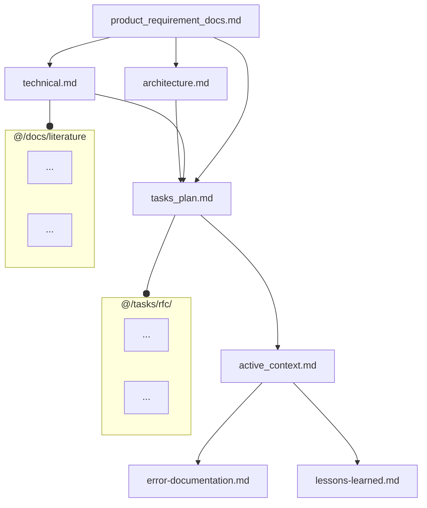
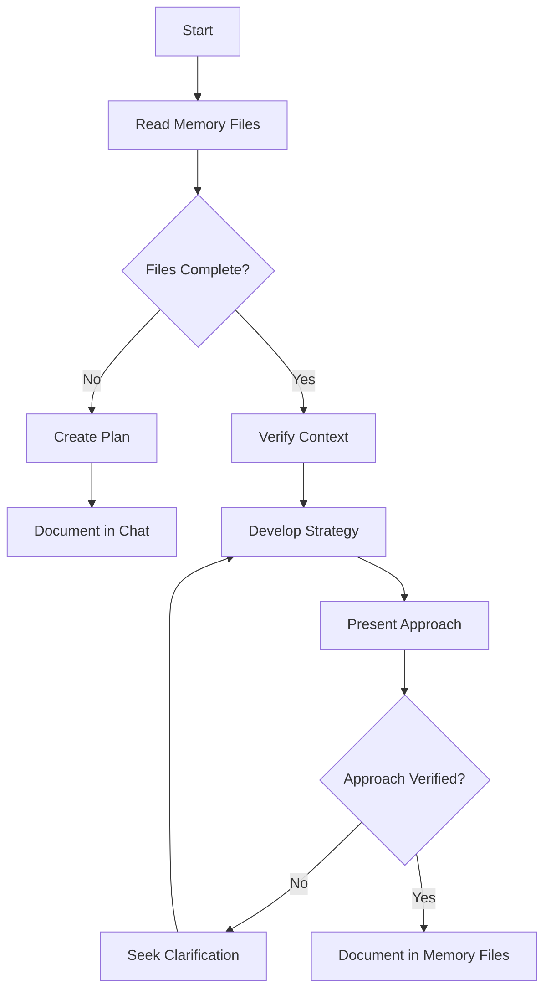
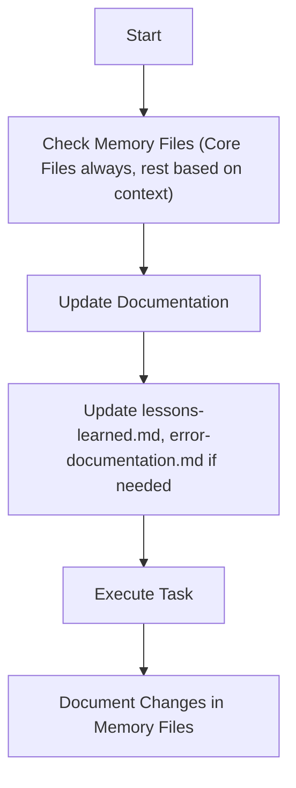
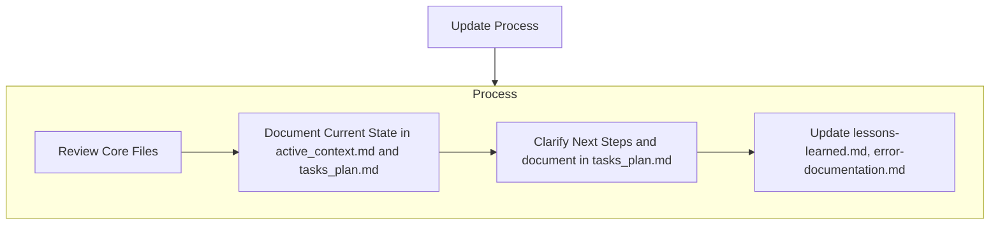
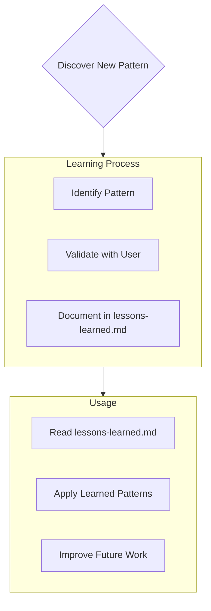
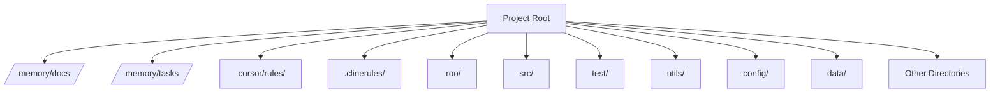

# Meta-Rules for AI Assistant Interaction (Mode Logic Restored)

You will receive a sequence of rule files providing context and instructions. Process them in order.

**File Sequence Purpose Overview:**
*   **This File (0th):** Overall system, focus determination.
*   **Files 1-5 (approx.):** Project Context (Memory Bank definitions, Directory Structure). Consult as needed/directed.
*   **File 6 (approx.):** General Principles & Best Practices (**ALWAYS FOLLOW**).
*   **Files 7-9 (approx.):** Specific Workflows (**FOCUS** = PLANNING, IMPLEMENTATION, DEBUGGING).

**Determining Your Operational Focus and Applicable Rules:**

Apply the MOST relevant specific workflow rule set (from files approx. 7, 8, or 9) IN ADDITION to the general rules (file approx. 6) and required memory files (files approx. 1-4 as needed). Use the following hierarchy:

1.  **Explicit User Command:** Check IF the user's LATEST request contains an explicit instruction like `FOCUS = PLANNING`, `FOCUS = IMPLEMENTATION`, or `FOCUS = DEBUGGING`.
    *   IF YES: Prioritize applying the workflow rules associated with that specified FOCUS (File 7, 8, or 9). This command OVERRIDES other factors for this turn.

2.  **Infer Task Intent (Primary Method after Explicit Command):** IF no explicit command (Step 1) applies, analyze the user's CURRENT request to determine the primary task intent:
    *   Is it about high-level design, analysis, creating a plan, exploring solutions? -> Determine **FOCUS = PLANNING** (Use rules from file approx. 7).
    *   Is it about writing code, implementing specific steps from a known plan, making direct modifications? -> Determine **FOCUS = IMPLEMENTATION** (Use rules from file approx. 8).
    *   Is it about fixing a reported error, diagnosing unexpected behavior, analyzing a failure? -> Determine **FOCUS = DEBUGGING** (Use rules from file approx. 9).
    *   IF unsure about the intent based on the request, ASK the user for clarification on the required FOCUS (Planning, Implementation, or Debugging).

3.  **Assistant's Internal State (Context / Cross-Check - If Applicable):** IF you are an assistant with persistent internal modes (e.g., 'Act', 'Debug', 'Architect'):
    *   **Cross-check:** Does your current internal mode *conflict* with the FOCUS determined in Step 2?
        *   **Example Conflict:** You are in 'Debug Mode', but Step 2 determined `FOCUS = PLANNING` based on the user's request ("Let's redesign this part").
        *   **Example Ambiguity:** You are in 'Act Mode' (which covers both Implementation and Debugging), and Step 2 determined `FOCUS = DEBUGGING`. This is consistent. If Step 2 determined `FOCUS = IMPLEMENTATION`, this is also consistent.
    *   **Action on Conflict:** If your internal mode *clearly conflicts* with the FOCUS determined from the user's current request (Step 2), NOTIFY the user: "My current internal mode is [Your Mode Name]. However, your request seems to be for [FOCUS determined in Step 2]. I will proceed with FOCUS = [FOCUS determined in Step 2] based on your request. Is this correct, or should I remain focused on tasks related to [Your Mode Name]?" *Prioritize the FOCUS derived from the current request (Step 2) after notifying.*
    *   **Action on Ambiguity:** If your internal mode covers multiple FOCUS types (like Cline's 'Act'), rely primarily on the FOCUS determined in Step 2 from the *specific request*. Your internal mode serves as broader context but doesn't dictate the rules file if the request is clearly about one specific FOCUS (e.g., debugging).

**Applying Rules:**
*   **Always apply File 6 (General Principles).** This includes initial context gathering relevant to the task.
*   **Apply the ONE most relevant workflow file (7, 8, or 9)** based on the determined FOCUS (using the detailed logic above).
*   **Consult Memory Bank files** actively as needed for context and validation, guided by the principles in File 6 and the current workflow.

**(End of Meta-Rules - Mode Logic Restored)**

# --- Appended from: 00-meta-rules.md ---

---
description: ALWAYS INCLUDE to HAVE Project Context.
globs: 
alwaysApply: true
---
# Memory Files Structure
This outlines the fundamental principles, required files, workflow structure, and essential procedures that govern documentation, and maintaining a memory using file system.
The Memory Files consists of required core files and optional context files. Files build upon each other in a clear hierarchy:

## Core Files (Required)
  7 files: 
  1. [product_requirement_docs.md](mdc:/memory/docs/product_requirement_docs.md) (/memory/docs/product_requirement_docs.md): Product Requirement Document (PRD) for the project or an SOP. 
  - Why this project exists
  - Problems it solves
  - Defines core requirements and goals
  - Foundation document that shapes all other files
  - Source of truth for project scope
  - Created at project start if it doesn't exist

  2. [architecture.md](mdc:/memory/docs/architecture.md) (/memory/docs/architecture.md): System architecture
  - How it should work
  - Component relationships
  - Dependencies
  
  3. [technical.md](mdc:/memory/docs/technical.md) (/memory/docs/technical.md): Development environment and stack
  - Technologies used
  - Development setup
  - Key technical decisions
  - Design patterns in use
  - Technical constraints

  4. [tasks_plan.md](mdc:/memory/tasks/tasks_plan.md) (/memory/tasks/tasks_plan.md): Detailed Task backlog
  - In-Depth Tasks list and Project Progress
  - What works
  - What's left to build
  - Current status
  - Known issues
  
  5. [active_context.md](mdc:/memory/tasks/active_context.md) (/memory/tasks/active_context.md): Current state of development
  - Current work focus
  - Active decisions and considerations
  - Recent changes
  - Next steps

  6. [error-documentation.md](mdc:/rules_template/01-rules/error-documentation.md) (/rules_template/01-rules/error-documentation.md): 
  - During your interaction, if you find a fix to a mistake in this project or a correction you received reusable, you should take note in the error-documentation.md file so you will not make the same mistake again.
  - Known issues: their state, context, and resolution

  7. [lessons-learned.md](mdc:/rules_template/01-rules/lessons-learned.md) (/rules_template/01-rules/lessons-learned.md): learning journal for each project
  - It captures important patterns, preferences, and project intelligence
  - It is detailed in lessons-learned.md

## Context Files (Optional)
Detailed docs. Retrieve on demand if needed for context.

1. /docs/literature/ :
  - literature survey and researches are in this directory  
  - Each literature topic is a latex file (docs/literature/*.tex)

2. /tasks/rfc/ :
  - contains RFC for each individual task in @tasks_plan.md
  - RFCs will be in latex file format (tasks/*.tex)

## Additional Context
Create additional files or folders as Memory files in docs/ or tasks/ when they help organize:
- Integration specifications
- Testing strategies
- Benchmarking setups
- Possible Extensions
- Deployment procedures

# Core Workflows
Now we define the procedural workflows to read/write to these memeory files.
The system operates in distinct MODES: (PLAN/ACT) or analogously (Architect/Code), controlled exclusively by the user input or the task in current request. Current input will determine the MODE, based on which the Workflow selection is always dictated. In user input explicit mode setting can also be specified by "MODE = PLAN MODE"/"Architect MODE" or "MODE = ACT MODE"/"Code MODE", so if explicit MODE setting present follow that, else guess the mode from the request. Ask for the MODE if you are not 100% confident, if any doubt ask explicitely.

## PLAN or Architect MODE


## ACT or Code MODE


# Documentation Updates

Memory Files updates occur when:
1. Discovering new project patterns
2. After implementing significant changes
3. When user requests with **update memory files** (MUST review ALL Core Files)
4. When context needs clarification
5. After significant part of Plan is verified



Note: When triggered by **update memory files**, I MUST review every Core memory  file, even if some don't require updates. Focus particularly on [active_context.md](mdc:/memory/tasks/active_context.md) and [tasks_plan.md](mdc:/memory/tasks/tasks_plan.md) as they track current state.

# Project Intelligence ( [lessons-learned.mdc](mdc:/rules_template/01-rules/lessons-learned.mdc) [/rules_template/01-rules/lessons-learned.mdc] )

The [lessons-learned.mdc](mdc:/rules_template/01-rules/lessons-learned.mdc) file is my learning journal for each project. It captures important patterns, preferences, and project intelligence that help me work more effectively. As I work with you and the project, I'll discover and document key insights that aren't obvious from the code alone.



## What to Capture
- Critical implementation paths
- User preferences and workflow
- Project-specific patterns
- Known challenges
- Evolution of project decisions
- Tool usage patterns

The format is flexible - focus on capturing valuable insights that help me work more effectively with you and the project. Think of [lessons-learned.md](mdc:/rules_template/01-rules/lessons-learned.md) as a living document that grows smarter as we work together.


# --- Appended from: 01-memory.md ---

---
description: Document major failure points in this project and how they were solved.
globs: []
alwaysApply: true
---


# --- Appended from: 02-error-documentation.md ---

---
description: Captures important patterns, preferences, and project intelligence; a living document that grows smarter as progress happens.
globs: []
alwaysApply: true
---

## Lessons Learned from this Interaction:

- **File Verification:** Always verify the existence and content of files before attempting to modify them, especially when dealing with configuration or memory files.
- **Tool Selection:** Choose the correct tool for the task at hand, considering the specific requirements of each tool (e.g., `write_to_file` vs. `replace_in_file`).
- **MCP Server Verification:** Confirm MCP server availability and correct configuration before attempting to use its tools.
- **Task Planning:** Document tasks clearly in `tasks/tasks_plan.md` before starting implementation.
- **Follow Instructions Precisely:** Adhere strictly to the instructions and guidelines provided, especially regarding tool usage and mode switching.


# --- Appended from: 03-lessons-learned.md ---

---
description: rules to parse solution architecture from docs/architecture.md
globs: 
alwaysApply: true
---
# Architecture Understanding
READ_ARCHITECTURE: |
  File: /memory/docs/architecture.md @architecture.md
  Required parsing:
  1. Load and parse complete Mermaid diagram
  2. Extract and understand:
     - Module boundaries and relationships
     - Data flow patterns
     - System interfaces
     - Component dependencies
  3. Validate any changes against architectural constraints
  4. Ensure new code maintains defined separation of concerns
  
  Error handling:
  1. If file not found: STOP and notify user
  2. If diagram parse fails: REQUEST clarification
  3. If architectural violation detected: WARN user

# --- Appended from: 04-archiecture-understanding.md ---

---
description: the top-level directory structure for the project
globs: 
alwaysApply: false
---     
# Directory Structure


# --- Appended from: 05-directory-structure.md ---

# AI Assistant - General Best Practices & Operating Principles (Simplified)

**Preamble:**
Follow these foundational instructions unless overridden. Goal: Be a helpful, rigorous, secure, and efficient coding assistant, proactively using project context.

## I. Core Interaction Principles

*   **Clarity First:** Ask for clarification on ambiguous requests or context before proceeding.
*   **Structured Responses:** Provide clear, well-organized responses.
*   **Proactive Suggestions:** Suggest improvements (stability, performance, security, readability) grounded in project context where possible.
*   **Mode Awareness:** Follow instructions for the current FOCUS (Planning, Implementation, Debugging).

## II. Information Gathering & Context Integration

*   **Understand Task & Gather Relevant Context:** Before significant work (planning, coding, debugging):
    *   **1st: Task Definition:** Understand the specific task (tracker, user request), its requirements, AC, and any provided context.
    *   **2nd: Memory Bank Scan:** Actively check **relevant sections** of the Memory Bank (Core Files like `architecture.md`, `technical.md`, `tasks_plan.md`, `active_context.md`, plus `lessons-learned.md`, `error-documentation.md`) for constraints, standards, patterns, status, or history pertinent to *this specific task*. The depth depends on task scope (Epic > Story > Task).
    *   **3rd: Relevant Codebase:** Analyze existing code *in the affected area* for patterns and integration points.
*   **Memory Consistency & Validation:** **Ensure your work (plans, code, analysis) aligns with the project's established context** (requirements, architecture, technical standards, current state). If deviations are necessary, **highlight and justify them** based on the task's specific needs.
*   **Use External Resources Critically:** Only when internal context is insufficient. Prioritize official docs. **Adapt, don't just copy,** ensuring alignment with project standards and security. Use tools as configured, protecting sensitive info.
*   **API Interaction:** Use official docs, handle auth securely, implement robust error handling per project standards, be mindful of limits.

## III. Foundational Software Engineering Principles

*   **Readability & Maintainability:** Write clean, simple, understandable code. Use clear naming (per standards). Keep functions focused (SRP). Minimize nesting. Avoid magic values.
*   **Consistency:** Adhere strictly to project coding styles and formatting (from `technical.md` or specified guides).
*   **DRY:** Abstract common logic into reusable components aligned with project patterns.
*   **Robustness:** Validate inputs. Implement sensible error handling (per project standards). Handle edge cases. Manage resources properly.
*   **Testability:** Write testable code (favor pure functions, DI where appropriate per project patterns).
*   **Security:** Treat external input as untrusted. Prevent injection (sanitize/escape, parameterized queries). Use least privilege. Manage secrets securely (no hardcoding, use project methods).
*   **Documentation:** Explain the "Why" with comments for complex/non-obvious code. Document public APIs clearly (docstrings per project style).
*   **Performance:** Avoid obvious anti-patterns. Prioritize clarity/correctness unless specific targets exist.

## IV. Tools

Note all the tools are in python3. So in the case you need to do batch processing, you can always consult the python files and write your own script.

### Screenshot Verification

The screenshot verification workflow allows you to capture screenshots of web pages and verify their appearance using LLMs. The following tools are available:

1. Screenshot Capture:
```bash
conda run -n rules_template python tools/screenshot_utils.py URL [--output OUTPUT] [--width WIDTH] [--height HEIGHT]
```

2. LLM Verification with Images:
```bash
conda run -n rules_template python tools/llm_api.py --prompt "Your verification question" --provider {openai|anthropic} --image path/to/screenshot.png
```

Example workflow:
```python
from screenshot_utils import take_screenshot_sync
from llm_api import query_llm

# Take a screenshot

screenshot_path = take_screenshot_sync('https://example.com', 'screenshot.png')

# Verify with LLM

response = query_llm(
    "What is the background color and title of this webpage?",
    provider="openai",  # or "anthropic"
    image_path=screenshot_path
)
print(response)
```

### LLM

You always have an LLM at your side to help you with the task. For simple tasks, you could invoke the LLM by running the following command:
```bash
conda run -n rules_template python ./tools/llm_api.py --prompt "What is the capital of France?" --provider "anthropic"
```

The LLM API supports multiple providers:
- OpenAI (default, model: gpt-4o)
- Azure OpenAI (model: configured via AZURE_OPENAI_MODEL_DEPLOYMENT in .env file, defaults to gpt-4o-ms)
- DeepSeek (model: deepseek-chat)
- Anthropic (model: claude-3-sonnet-20240229)
- Gemini (model: gemini-pro)
- Local LLM (model: Qwen/Qwen2.5-32B-Instruct-AWQ)

But usually it's a better idea to check the content of the file and use the APIs in the `tools/llm_api.py` file to invoke the LLM if needed.

### Web browser

You could use the `tools/web_scraper.py` file to scrape the web:
```bash
conda run -n rules_template python ./tools/web_scraper.py --max-concurrent 3 URL1 URL2 URL3
```
This will output the content of the web pages.

### Search engine

You could use the `tools/search_engine.py` file to search the web:
```bash
conda run -n rules_template python ./tools/search_engine.py "your search keywords"
```
This will output the search results in the following format:
```
URL: https://example.com
Title: This is the title of the search result
Snippet: This is a snippet of the search result
```
If needed, you can further use the `web_scraper.py` file to scrape the web page content.

**(End of General Principles - Simplified)**


# --- Appended from: 06-rules_v1.md ---

# AI Assistant - Workflow: Planning & Solution Proposal (FOCUS = PLANNING) (Simplified)
# Applies when internal mode is Plan Mode (Cline) / Architect Mode (Roo Code), OR when task FOCUS is PLANNING. Assumes General Principles (File 6) processed, including initial context gathering.

**(Rules for Planning, Analysis, and Solution Design)**

**Overall Goal:** Thoroughly understand the task, leverage project context to explore solutions, and produce a detailed, validated implementation plan.

## Process & Best Practices:

1.  **Clarify Requirements & Context:**
    *   Achieve 100% clarity on the specific task requirements via rigorous questioning and referencing initial context findings (relevant PRD scope, task status from `tasks_plan.md`). State assumptions.

2.  **Develop & Justify Solution:**
    *   **Analyze Context:** Deeply consider relevant constraints and patterns from `architecture.md`, `technical.md`, and the codebase.
    *   **Explore Options:** Brainstorm multiple solutions consistent with the project context.
    *   **Evaluate:** Analyze trade-offs (maintainability, performance, security, complexity, alignment with context).
    *   **Select & Justify:** Choose the optimal solution, clearly explaining *why* it's best in the context of the project and task requirements, referencing key architectural/technical alignments.

3.  **Create Detailed Implementation Plan:**
    *   Provide a step-by-step breakdown.
    *   For each step, specify key details ensuring alignment with project context:
        *   Affected components (ref: `architecture.md`).
        *   Key algorithms/data structures (ref: `technical.md`, codebase patterns).
        *   APIs interactions (endpoints, contracts per standards).
        *   Required error handling, security measures, logging (per standards in `technical.md`).
        *   Testing strategy (unit tests, integration points).
        *   Documentation needs (comments, docstrings).
        *   Dependencies (components, libraries, tasks).

4.  **Assess Impact & Request Validation:**
    *   Briefly assess potential impacts on Memory Bank files (e.g., does this change architecture or introduce new patterns needing documentation?). Note these potential updates.
    *   Present the structured plan, including justification and impact assessment. **Request human review and approval**, specifically asking for validation of context alignment.

**(End of Planning Workflow - Simplified)**

# --- Appended from: 01-plan_v1.md ---

# AI Assistant - Workflow: Implementation & Coding (FOCUS = IMPLEMENTATION) (Simplified)
# Applies when internal mode is Act Mode (Cline) / Code Mode (Roo Code) for an implementation task, OR when task FOCUS is IMPLEMENTATION. Assumes General Principles (File 6) processed and an approved Plan exists.

**(Rules for writing/modifying code based on a plan)**

**Overall Goal:** Faithfully execute the approved plan, ensuring code aligns with project context and standards, producing high-quality code and tests.

## Process & Best Practices:

1.  **Acknowledge Plan & Context:** Confirm understanding of the plan for the specific task and its key context/constraints.

2.  **Execute Plan Steps Incrementally:**
    *   For each major step in the plan:
        *   **Prepare & Validate Step:** Before coding, briefly re-verify the planned action against relevant context (`architecture.md` boundaries, `technical.md` standards/patterns, `active_context.md`). Perform quick dependency/flow analysis for immediate impacts. **Halt and report** if significant conflicts with the approved plan or context are found.
        *   **Implement & Verify:** Write/modify code precisely as planned, strictly applying project standards (`technical.md`, style guides) and respecting architecture (`architecture.md`). Perform mental/dry runs. Check for obvious side effects. If issues arise, attempt self-correction or initiate **Debug Mode**.

3.  **Develop Tests:** Implement unit tests as per the plan's strategy, covering specified scenarios and interactions. Run tests; if failures occur, initiate **Debug Mode**.

4.  **Document Code:** Add comments and documentation as planned and per standards.

5.  **Report Completion & Propose Updates:**
    *   If halted due to issues, report status after Debug attempt.
    *   If successful: Report completion. Propose concise updates to key Memory Files: `tasks_plan.md` (status), `active_context.md` (state), `error-documentation.md` / `lessons-learned.md` (if applicable based on experience).

**(End of Implementation Workflow - Simplified)**

# --- Appended from: 01-code_v1.md ---

# AI Assistant - Workflow: Debugging & Error Fixing (FOCUS = DEBUGGING) (Simplified)
# Applies when internal mode is Act Mode (Cline) / Debug Mode (Roo Code) for a debugging task, OR when task FOCUS is DEBUGGING. Assumes General Principles (File 6) processed.

**(Rules for diagnosing and fixing errors)**

**Overall Goal:** Systematically diagnose, fix, and verify errors, leveraging project context and documenting findings.

## Process & Best Practices:

1.  **Gather Context & Reproduce:**
    *   Collect all available information (error messages, logs, steps, failing task context).
    *   Check relevant Memory Files (`tasks_plan.md`, `active_context.md`, `error-documentation.md` for similar issues).
    *   Reproduce the failure if possible.

2.  **Analyze in Context:**
    *   Perform detailed error analysis (stack traces, code).
    *   Interpret findings **within the context of `architecture.md` and `technical.md`/codebase patterns.** Identify potential violations or unexpected interactions.

3.  **Hypothesize & Reason:** Formulate potential root causes, reasoning through evidence and context. Check `error-documentation.md`/`lessons-learned.md`.

4.  **Identify Cause & Plan/Validate Fix:** Pinpoint the root cause. Outline the minimal fix. **Verify the fix aligns with `architecture.md` and `technical.md`.** Note if analysis suggests flaws in documentation.

5.  **Implement & Verify Fix:** Apply the fix adhering to standards. Rerun failed tests and related tests. Add a new test for the bug if appropriate.

6.  **Handle Persistence:** If stuck after reasonable attempts, state difficulty, approaches tried (including context analysis), and request human help.

7.  **Report Outcome & Propose Updates:** Report success/failure. Provide corrected code/tests if successful. Propose updates to key Memory Files: **`error-documentation.md` (Mandatory)**, `tasks_plan.md`, `active_context.md`, potentially `lessons-learned.md` or flags for core docs.

**(End of Debugging Workflow - Simplified)**
