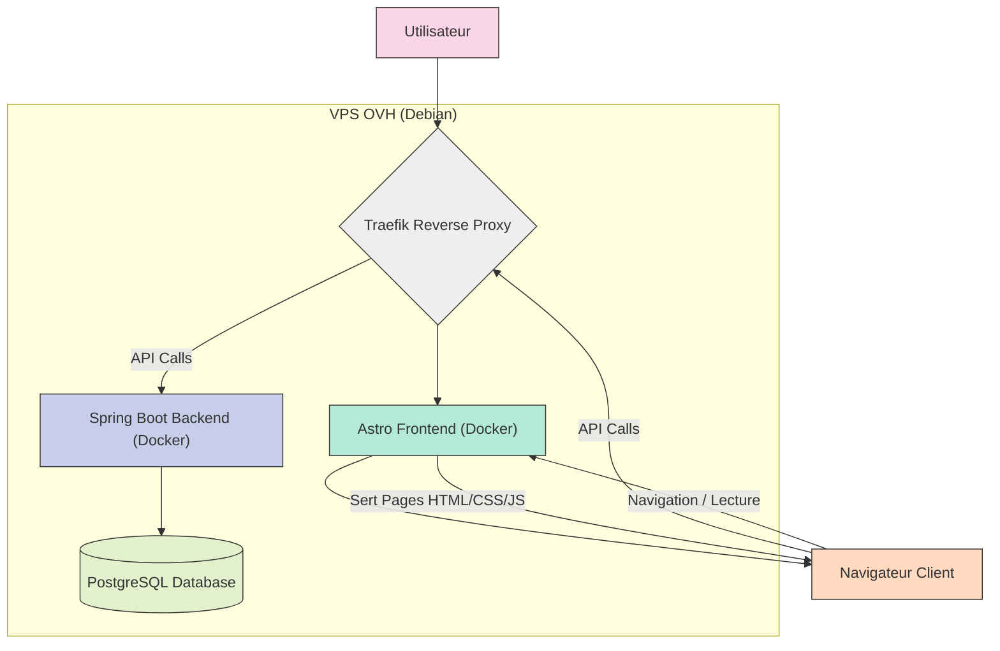
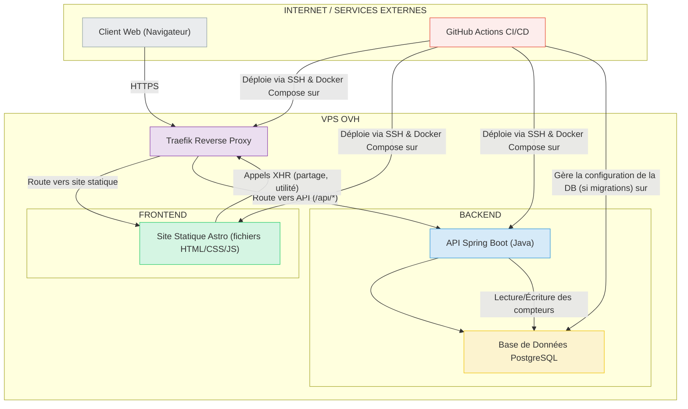

# Blog Technique Bilingue - Document d'Architecture

## Résumé Technique

L'architecture de ce projet vise à mettre en place un blog technique bilingue (français et anglais) performant et maintenable. Conformément aux objectifs définis dans le PRD (document "2.4 PRD Stack.md"), le système s'appuiera sur une génération de site statique avec **Astro** pour le frontend, permettant de servir des articles écrits en **MDX**. Le design sera implémenté avec **TailwindCSS** et **DaisyUI**. Les fonctionnalités dynamiques minimales du MVP, telles que le comptage anonyme des partages d'articles et des votes d'utilité, seront gérées par un backend léger développé en **Spring Boot (Java)**. Ces données de comptage seront stockées dans une base de données **PostgreSQL**. L'ensemble sera hébergé sur un serveur privé virtuel (VPS) OVH existant (Debian), en utilisant **Docker** pour la conteneurisation des applications et **Traefik** comme reverse proxy pour la gestion HTTPS et le routage. Une attention particulière sera portée à l'optimisation SEO, notamment via la gestion des URLs distinctes par langue et des balises `hreflang`.

## Vue d'Ensemble de Haut Niveau

L'architecture retenue est une **Architecture Découplée Statique/API**. Cette approche sépare clairement la présentation (le site statique généré par Astro) des services de bas-niveau (l'API Spring Boot).

Le flux principal utilisateur est le suivant :
1.  L'utilisateur accède au site web via son navigateur.
2.  Traefik reçoit la requête HTTPS et la route vers le conteneur Docker servant les fichiers statiques générés par Astro.
3.  Le navigateur de l'utilisateur charge les pages statiques (HTML, CSS, JavaScript). Les articles (MDX) sont rendus en HTML.
4.  Pour les interactions nécessitant un traitement backend (ex: clic sur "article utile" ou partage social), le frontend Astro effectue un appel API asynchrone vers le backend Spring Boot.
5.  Traefik route ces appels API vers le conteneur Docker de l'application Spring Boot.
6.  L'application Spring Boot traite la requête (ex: incrémente un compteur) et interagit avec la base de données PostgreSQL si nécessaire.
7.  Une réponse (généralement une simple confirmation ou un état) est retournée au frontend.

Voici un diagramme illustrant cette vue d'ensemble :


## Vue des Composants

Le système est composé de plusieurs éléments principaux qui interagissent pour fournir les fonctionnalités du blog technique bilingue. Ces composants sont conçus pour être déployés dans des conteneurs Docker sur le VPS OVH, orchestrés par un pipeline de CI/CD externe.



- **Client Web (Navigateur)** :
    - **Responsabilité :** Afficher le site web à l'utilisateur, permettre la navigation, la lecture des articles, et initier les interactions (sélection de langue, partage, vote d'utilité, recherche).
    - **Technologies :** HTML, CSS, JavaScript (générés par Astro).

- **GitHub Actions (CI/CD - Service Externe)** :
    - **Responsabilité :** Orchestrer le cycle de vie de développement logiciel. Sur des événements dans le dépôt GitHub (ex: push sur la branche principale), automatiser le build du frontend Astro et du backend Spring Boot, la création des images Docker, l'exécution des tests (unitaires, intégration, E2E avec Cypress, analyse de sécurité avec Trivy), et le déploiement des nouvelles versions des conteneurs sur le VPS OVH (par exemple, via SSH pour exécuter des commandes `docker compose up -d`).
    - **Technologies :** GitHub Actions, Docker, Docker Compose, Vitest, Cypress, Trivy.

- **Traefik Reverse Proxy (Conteneur Docker sur VPS OVH)** :
    - **Responsabilité :** Point d'entrée unique pour toutes les requêtes HTTP/HTTPS sur le VPS. Gérer les certificats SSL/TLS (via Let's Encrypt), router les requêtes vers le conteneur du frontend Astro pour les pages du site, et vers le conteneur du backend Spring Boot pour les appels API (par exemple, sur un chemin `/api/...`). Si le dashboard de Traefik est activé en production, il devra être sécurisé par une authentification appropriée (ex: Basic Auth).
    - **Technologies :** Traefik.

- **Frontend Astro (Site Statique - servi via un conteneur Docker sur VPS OVH)** :
    - **Responsabilité :** Générer (au moment du build par GitHub Actions) et servir les pages HTML statiques du blog. Gérer l'affichage bilingue des articles (MDX), la navigation, le sélecteur de langue, l'intégration Google Analytics. Initier les appels JavaScript vers l'API backend pour les compteurs. Implémenter la logique de recherche côté client (ex: Pagefind) ou intégrer un service externe.
    - **Technologies :** Astro, MDX, TailwindCSS, DaisyUI, JavaScript. Le conteneur Docker utilisera un serveur web simple (comme Nginx ou Caddy) pour servir les fichiers statiques.

- **Backend Spring Boot (API - Conteneur Docker sur VPS OVH)** :
    - **Responsabilité :** Fournir des endpoints API RESTful sécurisés pour les fonctionnalités dynamiques. Pour le MVP, cela inclut :
        - Enregistrer les clics de partage social (anonymement).
        - Enregistrer les votes "Oui/Non" sur l'utilité d'un article (anonymement).
        - Interagir avec la base de données PostgreSQL pour stocker et récupérer ces compteurs.
    - **Technologies :** Spring Boot (Java), Spring Web, Spring Data JPA (potentiellement).

- **Base de Données PostgreSQL (Conteneur Docker sur VPS OVH)** :
    - **Responsabilité :** Stocker de manière persistante les données des compteurs anonymes (nombre de partages par article, nombre de votes "utile:oui" et "utile:non" par article). Les sauvegardes sont gérées au niveau du VPS OVH. Les migrations de schéma (si nécessaires) peuvent être gérées par des outils comme Flyway ou Liquibase, potentiellement déclenchées lors du déploiement backend par GitHub Actions.
    - **Technologies :** PostgreSQL.

**Interactions Clés :**
1. **Affichage d'une page :** Navigateur -> Traefik (VPS) -> Astro (fichiers statiques sur VPS).
2. **Interaction utilisateur (ex: vote d'utilité) :** Navigateur (JavaScript d'Astro) -> Traefik (VPS) -> API Spring Boot (VPS) -> Base de Données PostgreSQL (VPS).
3. **Déploiement :** Développeur (push sur GitHub) -> GitHub Actions (Cloud GitHub) -> Build des images Docker -> Connexion SSH au VPS -> Déploiement sur VPS (mise à jour des conteneurs Docker via Docker Compose).
## Décisions Architecturales Clés & Motifs

Plusieurs décisions architecturales et choix technologiques ont été définis pour répondre aux exigences du Blog Technique Bilingue, en mettant l'accent sur la performance, la maintenabilité, la sécurité et l'évolutivité du MVP.

-   **Choix 1 : Architecture Découplée Statique/API**
    * **Décision :** Adopter une architecture où le frontend est un site statique généré et le backend est une API distincte pour les fonctionnalités dynamiques minimales.
    * **Justification :**
        * **Performance :** Les sites statiques sont intrinsèquement rapides à servir.
        * **Sécurité :** Réduction de la surface d'attaque côté frontend (pas d'exécution de code serveur complexe pour l'affichage).
        * **Scalabilité :** Le frontend statique peut être facilement distribué via des CDN (évolution future). Le backend peut être dimensionné indépendamment.
        * **Maintenabilité :** Séparation claire des préoccupations entre la présentation (Astro) et la logique métier (Spring Boot).
        * **Coût :** L'hébergement de fichiers statiques est généralement peu coûteux.

-   **Choix 2 : Frontend avec Astro et MDX**
    * **Décision :** Utiliser **Astro** comme générateur de site statique et **MDX** pour la gestion du contenu des articles. **TailwindCSS** et **DaisyUI** pour le style.
    * **Justification :**
        * **Astro :**
            * Performances excellentes ("zero JavaScript by default", îles d'hydratation pour les composants interactifs).
            * Bon écosystème pour les blogs et sites de contenu (collections de contenu, support MDX).
            * Facilite la gestion du bilinguisme (routage, internationalisation).
            * Permet l'intégration de composants issus de divers frameworks si besoin (React, Vue, Svelte) pour des interactions spécifiques.
        * **MDX :**
            * Permet d'écrire du contenu en Markdown tout en intégrant des composants interactifs (JSX), idéal pour des articles techniques avec des exemples de code ou des visualisations.
            * Simplifie le workflow de création de contenu pour les rédacteurs techniques.
        * **TailwindCSS & DaisyUI :**
            * Approche "utility-first" de TailwindCSS pour un développement rapide et un design sur mesure.
            * DaisyUI fournit des composants pré-stylés sur TailwindCSS, accélérant le développement de l'UI tout en restant personnalisable.

-   **Choix 3 : Backend avec Spring Boot (Java)**
    * **Décision :** Utiliser **Spring Boot (Java)** pour développer l'API backend.
    * **Justification :**
        * Imposé par le cahier des charges initial, s'appuyant sur une **expertise Java/Spring Boot existante**.
        * Robuste et éprouvé pour la création d'API RESTful.
        * Vaste écosystème, bonne documentation et support communautaire.
        * Envisagé pour des **évolutions futures comme la gestion de newsletters** (inscription, envoi d'emails), ce qui justifie l'utilisation d'un framework plus complet dès le MVP malgré des besoins initiaux simples (quelques endpoints pour les compteurs).
        * L'empreinte mémoire et le temps de démarrage seront des points d'attention pour un usage sur VPS.

-   **Choix 4 : Base de données PostgreSQL**
    * **Décision :** Utiliser **PostgreSQL** comme base de données relationnelle.
    * **Justification :**
        * Imposé par le cahier des charges initial.
        * Base de données open-source puissante, fiable et riche en fonctionnalités.
        * Adaptée pour stocker les données structurées des compteurs et potentiellement les données des abonnés newsletter à l'avenir.
        * La sauvegarde quotidienne est déjà assurée par l'infrastructure VPS OVH.

-   **Choix 5 : Hébergement sur VPS OVH existant avec Docker et Traefik**
    * **Décision :** Déployer l'application sur le VPS OVH (Debian) existant en utilisant **Docker** pour la conteneurisation et **Traefik** comme reverse proxy.
    * **Justification :**
        * **VPS OVH :** Utilisation de l'infrastructure existante, maîtrise des coûts.
        * **Docker :**
            * Isolation des environnements pour chaque composant (frontend, backend, base de données).
            * Reproductibilité des builds et des déploiements.
            * Simplification de la gestion des dépendances et des versions.
        * **Traefik :**
            * Gestion simplifiée du reverse proxy et de la configuration du routage.
            * Intégration native avec Docker pour découvrir et configurer automatiquement les services.
            * Gestion automatique des certificats SSL/TLS via Let's Encrypt.

-   **Choix 6 : CI/CD avec GitHub Actions**
    * **Décision :** Utiliser **GitHub Actions** pour l'intégration continue et le déploiement continu.
    * **Justification :**
        * Intégration native avec les dépôts GitHub.
        * Large éventail d'actions prédéfinies et personnalisables.
        * Permet d'automatiser les builds, les tests (unitaires, intégration, E2E), l'analyse de sécurité (Trivy) et le déploiement sur le VPS (via Docker Compose et SSH).
        * Gratuit pour les dépôts publics et avec un quota généreux pour les dépôts privés.

-   **Choix 7 : Gestion du Bilinguisme**
    * **Décision :** Gérer le bilinguisme (français/anglais) nativement au niveau d'Astro, avec des URLs distinctes (ex: `/fr/`, `/en/`) et la génération des balises `hreflang` pour le SEO.
    * **Justification :**
        * Essentiel pour le SEO et l'expérience utilisateur sur un site bilingue.
        * Astro fournit des mécanismes pour gérer les collections de contenu multilingues et le routage internationalisé.
        * Liaison claire entre les versions linguistiques des articles MDX.

-   **Choix 8 : Recherche Statique avec Pagefind (MVP)**
    * **Décision :** Utiliser **Pagefind** pour la fonctionnalité de recherche sur le site statique pour le MVP.
    * **Justification :**
        * **Pagefind :** S'indexe au moment du build et fonctionne entièrement côté client, sans serveur backend pour la recherche, ce qui est idéal pour un site statique.
        * Performances généralement bonnes pour des volumes de contenu modestes à moyens.
        * Maintient la nature statique du site et évite des coûts supplémentaires initiaux (pas de budget pour des solutions comme Algolia au lancement).
        * S'intègre bien avec l'écosystème Astro.

-   **Choix 9 : Anonymisation des compteurs**
    * **Décision :** Les compteurs de partage et d'utilité des articles doivent être anonymes. Aucune information personnelle identifiable de l'utilisateur ne sera collectée pour ces fonctionnalités.
    * **Justification :**
        * Conformité RGPD : Minimisation de la collecte de données.
        * Simplicité : Évite la complexité de la gestion du consentement et de la sécurité des données personnelles pour ces fonctionnalités MVP.

-   **Choix 10 : Application du Pattern Repository et Dependency Injection (Backend)**
    * **Décision :** Utiliser explicitement le **Pattern Repository** pour l'accès aux données et la **Dependency Injection (DI)** dans le backend Spring Boot.
    * **Justification :**
        * **Repository Pattern :** Implicitement fourni par Spring Data JPA, ce pattern abstrait la logique de persistance des données, rendant le code plus modulaire et plus facile à tester. Il sépare la logique métier des préoccupations de bas niveau liées à la base de données.
        * **Dependency Injection :** Fondamentale dans Spring Boot, la DI permet d'obtenir un couplage lâche entre les composants (beans), améliore la testabilité (facilitant le mocking des dépendances) et la maintenabilité du code backend.
        * Ces patterns seront détaillés dans les normes de codage backend (`docs/contribution/normes-codage.md`).

-   **Choix 11 : Standardisation des Réponses d'Erreur API**
    * **Décision :** Adopter un format JSON standardisé pour toutes les réponses d'erreur de l'API Spring Boot.
    * **Justification :**
        * **Cohérence :** Fournit une manière uniforme pour le frontend (et tout autre client API) de traiter les erreurs.
        * **Clarté :** Facilite le débogage et la compréhension des problèmes.
        * **Robustesse :** Permet une gestion des erreurs plus fiable côté client.
        * Le format inclura typiquement des champs comme `timestamp`, `status` (code HTTP), `error` (description textuelle du code HTTP), `message` (message d'erreur spécifique à l'application et lisible), et `path` (chemin de la requête ayant causé l'erreur). Ce format sera détaillé dans la section "API Design" et le document `docs/architecture/api-reference.md`.
## Infrastructure et Déploiement

### Vue d'Ensemble de l'Infrastructure

-   **Fournisseur d'Hébergement :** L'application sera hébergée sur un **VPS OVH existant**, fonctionnant sous **Debian GNU/Linux**. Ce choix est motivé par l'utilisation d'une ressource préexistante et la maîtrise des coûts.
-   **Services Clés sur le VPS :**
    * **Docker Engine :** Utilisé pour exécuter les différents composants de l'application (frontend, backend, base de données) dans des conteneurs isolés.
    * **Traefik Proxy :** Agit comme reverse proxy, gérant les requêtes entrantes, la terminaison SSL/TLS (avec certificats Let's Encrypt), et le routage vers les conteneurs Docker appropriés.
    * **PostgreSQL Server :** Le service de base de données PostgreSQL s'exécutera également dans un conteneur Docker, avec un volume persistant pour les données.
    * **Serveur Web pour le site statique Astro :** Un serveur web léger (par exemple Nginx, Caddy, ou même `serve` de Vercel) sera utilisé à l'intérieur du conteneur Docker du frontend pour servir les fichiers statiques générés par Astro.

-   **Infrastructure en tant que Code (IaC) :**
    * **Docker Compose :** Utilisé pour définir et gérer les services multi-conteneurs sur le VPS. Les fichiers `docker-compose.yml` décriront les services, réseaux, et volumes nécessaires pour l'application en production et faciliteront également la configuration de l'environnement de développement local.
    * La configuration de Traefik sera également gérée par des fichiers et des labels Docker, s'intégrant avec Docker Compose. Un fichier principal `traefik.yml` définira la configuration statique (points d'entrée, fournisseurs, certificats resolvers comme Let's Encrypt). Les configurations dynamiques, telles que le routage spécifique aux services et la sécurisation du dashboard Traefik, seront gérées via des labels Docker directement sur les services concernés dans `docker-compose.yml`.

### Stratégie de Déploiement

-   **Pipeline CI/CD :** Un pipeline d'intégration continue et de déploiement continu (CI/CD) sera mis en place avec **GitHub Actions**.
-   **Déclencheurs de Déploiement :** Typiquement, un push ou un merge sur la branche principale (ex: `main` ou `master`) du dépôt GitHub déclenchera le pipeline de production.
-   **Étapes du Pipeline (simplifié) :**
    1.  **Checkout :** Récupération du code source depuis GitHub.
    2.  **Setup Environnement :** Configuration de l'environnement de build (Node.js pour Astro, JDK pour Spring Boot).
    3.  **Tests & Analyse :**
        * Exécution des tests unitaires et d'intégration (Vitest pour Astro, JUnit/Spring Test pour Spring Boot).
        * Analyse de sécurité des images Docker avec Trivy.
        * (Optionnel pour MVP, mais recommandé) Tests E2E avec Cypress.
    4.  **Build des Applications :**
        * Frontend : `npm run build` (ou commande Astro équivalente) pour générer les fichiers statiques.
        * Backend : `mvn package` (ou commande Gradle équivalente) pour compiler le JAR Spring Boot.
    5.  **Build des Images Docker :** Création des images Docker pour le frontend (intégrant les fichiers statiques et un serveur web Nginx) et le backend (intégrant le JAR de l'application). Les images seront taguées avec un identifiant unique (ex: hash du commit ou numéro de build).
    6.  **Push des Images Docker :** Les images Docker construites et taguées seront poussées vers **GitHub Container Registry (GHCR)**. Cela assure une gestion versionnée et centralisée des artéfacts de déploiement.
    7.  **Déploiement sur VPS :**
        * Connexion sécurisée au VPS (via SSH).
        * **Pull des Images Docker :** Le VPS récupère les nouvelles versions des images depuis GitHub Container Registry (`docker compose pull nom_service_frontend nom_service_backend`).
        * **Redémarrage des Services :** Mise à jour et redémarrage des services via `docker compose up -d`. Les services concernés utiliseront les nouvelles images tirées.
        * **Migrations de Base de Données :** Les migrations de schéma PostgreSQL seront gérées avec **Liquibase**. Les scripts de migration seront inclus dans l'application Spring Boot et pourront être appliqués automatiquement au démarrage de l'application backend, ou via une commande spécifique déclenchée par le pipeline de CI/CD après le build du backend et avant le déploiement final.
-   **Rollback :** En cas de problème avec une nouvelle version, le rollback s'effectuera en redéployant une version d'image Docker stable précédente depuis GHCR. Cela peut être réalisé en mettant à jour les tags d'image dans la configuration Docker Compose sur le VPS et en réappliquant la commande `docker compose up -d`. Des procédures plus détaillées et potentiellement automatisées seront décrites dans `docs/ci-cd/pipeline.md` ou `docs/operations/runbook.md`.
-   **Outils de Déploiement :**
    * **GitHub Actions** pour l'orchestration du pipeline.
    * **GitHub Container Registry** pour le stockage des images Docker.
    * **Docker** et **Docker Compose** sur le VPS pour la gestion des conteneurs.
    * **Liquibase** pour la gestion des migrations de la base de données PostgreSQL.
    * **SSH** pour la communication sécurisée entre GitHub Actions et le VPS.

-   **Outils de Déploiement :**
    * **GitHub Actions** pour l'orchestration du pipeline.
    * **GitHub Container Registry** pour le stockage des images Docker.
    * **Docker** et **Docker Compose** sur le VPS pour la gestion des conteneurs.
    * **Liquibase** pour la gestion des migrations de la base de données PostgreSQL.
    * **SSH** pour la communication sécurisée entre GitHub Actions et le VPS.

### Environnements

-   **Développement Local :**
    * Les développeurs pourront exécuter l'ensemble de l'application (frontend Astro en mode dev, backend Spring Boot, PostgreSQL) localement via Docker Compose.
    * Des fichiers `docker-compose.override.yml` ou des profils Docker Compose spécifiques pourront être utilisés pour adapter la configuration au développement (ex: live-reloading, ports différents). L'instance locale de PostgreSQL utilisera également Liquibase pour assurer la cohérence du schéma.
-   **Production :**
    * Environnement unique sur le VPS OVH.
    * Les configurations spécifiques à la production (ex: secrets, URLs) seront gérées via des variables d'environnement injectées dans les conteneurs Docker par Docker Compose, elles-mêmes potentiellement gérées via des secrets GitHub Actions pour le pipeline de déploiement.
-   **Staging (Hors MVP initial) :**
    * Un environnement de staging est souhaitable à terme pour valider les changements avant la mise en production, surtout si la complexité augmente. Pour le MVP, il n'est pas prioritaire mais l'architecture basée sur Docker et GitHub Container Registry faciliterait sa mise en place (par exemple avec une configuration Traefik et Docker Compose distincte, potentiellement sur le même VPS avec des sous-domaines différents ou sur un autre petit VPS, tirant des images spécifiques de GHCR).
## Documents de Référence Clés

Cette section liste les documents essentiels qui fournissent un contexte supplémentaire, des détails de conception, ou des spécifications pour le projet Blog Technique Bilingue. Ils sont destinés à être stockés dans un répertoire `docs/` au sein du dépôt de code principal.

-   **`docs/prd-blog-bilingue.md`**: (Nom de fichier suggéré pour le PRD que vous avez fourni : "2.4 PRD Stack.md")
    * Le Document des Exigences Produit (PRD) qui décrit la vision du produit, les objectifs, les fonctionnalités MVP, les exigences fonctionnelles et non fonctionnelles, et les contraintes techniques initiales.

-   **`docs/architecture/README.md` ou `docs/architecture/architecture-principale.md`**: (Ce document que nous sommes en train de créer)
    * Ce document principal d'architecture, décrivant la vue d'ensemble, les composants, les décisions clés, l'infrastructure et le déploiement.

-   **`docs/architecture/tech-stack.md`**:
    * Un document détaillant la stack technologique complète, y compris les langages, frameworks, bases de données, outils de CI/CD, et leurs versions spécifiques. (Basé sur le "Tech Stack Template").

-   **`docs/architecture/data-models.md`**:
    * Description des modèles de données principaux, y compris les schémas de la base de données PostgreSQL pour les compteurs, et potentiellement les structures des données de configuration des articles MDX si des aspects spécifiques doivent être normalisés. (Basé sur le "Data Models Template").

-   **`docs/architecture/api-reference.md`**:
    * Documentation des endpoints de l'API Spring Boot (comptage des partages, comptage de l'utilité). Détaille les requêtes, les réponses, et les codes de statut. (Basé sur le "API Reference Template").

-   **`docs/setup/environnement-dev.md`**:
    * Instructions pour configurer l'environnement de développement local, y compris l'utilisation de Docker Compose.

-   **`docs/setup/environnement-vars.md`**:
    * Liste et description des variables d'environnement nécessaires pour les différents environnements (local, production). (Basé sur le "Environment Vars Template").

-   **`docs/ci-cd/pipeline.md`**:
    * Description détaillée du pipeline CI/CD avec GitHub Actions, incluant les étapes, les déclencheurs, et la gestion des secrets.

-   **`docs/bilinguisme/gestion-contenu.md`**:
    * Directives spécifiques sur la gestion du contenu bilingue avec Astro et MDX, y compris la structure des fichiers, la liaison entre les traductions, et les bonnes pratiques SEO pour le multilingue.

-   **`docs/tests/strategie-tests.md`**:
    * La stratégie de test globale, couvrant les tests unitaires, d'intégration, E2E, de performance et de sécurité. (Basé sur le "Testing Strategy Template").

-   **`docs/contribution/normes-codage.md`**:
    * Les normes de codage pour le frontend (Astro/TS/JS) et le backend (Java/Spring Boot). (Basé sur le "Coding Standards Template").

-   **`docs/ui-ux/ui-ux-spec.md`**:
    * Spécifications UI/UX détaillées, incluant les wireframes, les maquettes (si disponibles), les parcours utilisateurs clés du point de vue de l'interface, et les directives d'accessibilité.

-   **`docs/seo/strategie-seo.md`**:
    * Stratégie SEO technique et de contenu détaillée, incluant l'analyse de mots-clés, la structure des URLs, la gestion des métadonnées, le plan de sitemap, et les aspects du SEO international.

-   **`docs/securite/plan-securite.md`**:
    * Plan de sécurité détaillé, couvrant l'analyse des menaces, les mesures de mitigation spécifiques pour chaque composant, la gestion des dépendances vulnérables, et les procédures de réponse aux incidents.

-   **`docs/epic1.md`, `docs/epic2.md`, ...**:
    * Fichiers Epic détaillant les exigences fonctionnelles spécifiques (comme mentionné dans votre PRD).

## API Design

Cette section détaille la conception des API exposées par les composants backend du système. Pour le MVP, cela concerne principalement l'API de gestion des métriques.

*(Note : Pour une spécification plus formelle et évolutive, notamment si le nombre d'endpoints augmente significativement, cette section pourra être externalisée vers un document de référence OpenAPI (ex: `api-reference.yaml`) et/ou générée automatiquement depuis le code backend à l'avenir.)*

### Metrics API (Backend Spring Boot)

-   **Purpose:** Fournir des endpoints pour enregistrer de manière anonyme les interactions des utilisateurs avec les articles, telles que les partages et les votes d'utilité. Ces métriques sont stockées dans la base de données PostgreSQL.
-   **Base URL(s):** `/api/v1/metrics`
-   **Authentication/Authorization:** Aucune authentification requise pour le MVP. Les endpoints sont publics. Des mesures de limitation de débit (rate limiting) pourraient être envisagées post-MVP pour prévenir les abus.
-   **Data Format:** JSON (application/json) pour les requêtes et les réponses.
-   **Error Handling:**
    -   Les erreurs API (validation, serveur, etc.) retourneront une réponse JSON standardisée. Ce format inclura systématiquement les champs suivants :
        -   `timestamp` (String, ISO 8601) : L'heure à laquelle l'erreur s'est produite.
        -   `status` (Integer) : Le code de statut HTTP.
        -   `error` (String) : La description textuelle du code de statut HTTP (ex: "Bad Request", "Internal Server Error").
        -   `message` (String) : Un message descriptif de l'erreur, spécifique à l'application et potentiellement lisible par un utilisateur technique.
        -   `path` (String) : Le chemin de l'API qui a été appelé.
    -   Exemple pour une erreur `400 Bad Request` :
        ```json
        {
          "timestamp": "2025-05-10T18:30:00.123Z",
          "status": 400,
          "error": "Bad Request",
          "message": "Validation failed: Le champ 'vote' ne peut pas être nul et doit être 'yes' ou 'no'.",
          "path": "/api/v1/metrics/article/mon-slug/fr/feedback"
        }
        ```
    -   Les erreurs de validation des requêtes (ex: payload incorrect, paramètre de chemin manquant) retourneront typiquement un statut `400 Bad Request`.
    -   Les erreurs serveur non prévues retourneront un statut `500 Internal Server Error`.
    -   Si une ressource spécifique (article par slug/lang) n'est pas trouvée pour enregistrer une métrique, cela sera géré en interne (création d'une nouvelle entrée de métrique pour le MVP) et ne devrait pas résulter en une erreur `404 Not Found` pour ces endpoints POST spécifiques.

-   **Endpoints:**
    -   **`POST /api/v1/metrics/article/{articleCanonicalSlug}/{lang}/share`**
        -   **Description:** Incrémente le compteur de partage pour une version linguistique spécifique d'un article.
        -   **Request Parameters (Path):**
            -   `articleCanonicalSlug` (String, requis): Le slug canonique de l'article (ex: "mon-super-article-tauri").
            -   `lang` (String, requis): Le code de langue de l'article (ex: "fr", "en"). Doit correspondre à une des langues supportées et stockées.
        -   **Request Body Schema:** Aucun.
        -   **Success Response (Code: `200 OK`):**
            ```json
            {
              "shareCount": 124 // Le nouveau total de partages pour cet article/langue
            }
            ```
            * `shareCount` (Integer): Le nombre total de partages enregistrés après l'incrémentation.
        -   **Error Response Schema(s):**
            -   `400 Bad Request`: Si les paramètres de chemin sont mal formés ou manquants (géré par Spring MVC).
            -   `500 Internal Server Error`: En cas d'erreur interne du serveur lors du traitement.

    -   **`POST /api/v1/metrics/article/{articleCanonicalSlug}/{lang}/feedback`**
        -   **Description:** Enregistre un vote d'utilité (positif ou négatif) pour une version linguistique spécifique d'un article.
        -   **Request Parameters (Path):**
            -   `articleCanonicalSlug` (String, requis): Le slug canonique de l'article.
            -   `lang` (String, requis): Le code de langue de l'article.
        -   **Request Body Schema:** `application/json`
            ```json
            {
              "vote": "yes" // ou "no"
            }
            ```
            * `vote` (String, requis): Doit être l'une des valeurs "yes" ou "no". La validation est assurée par le backend via l'Enum `FeedbackVote`. (Voir DTO `ArticleFeedbackPayload` et Enum `FeedbackVote` dans `data-models.txt`).
        -   **Success Response (Code: `200 OK`):**
            ```json
            {
              "usefulYesCount": 88, // Le nouveau total de votes "oui"
              "usefulNoCount": 12   // Le nouveau total de votes "non"
            }
            ```
            * `usefulYesCount` (Integer): Le nombre total de votes "utiles" enregistrés après l'opération.
            * `usefulNoCount` (Integer): Le nombre total de votes "pas utiles" enregistrés après l'opération.
        -   **Error Response Schema(s):**
            -   `400 Bad Request`: Si les paramètres de chemin sont mal formés, manquants, ou si le corps de la requête est invalide (ex: `vote` manquant ou valeur incorrecte).
            -   `500 Internal Server Error`: En cas d'erreur interne du serveur.
## Change Log

| Date       | Version | Description                                                                                                                                                                                                                      | Auteur                            |
| :--------- | :------ | :------------------------------------------------------------------------------------------------------------------------------------------------------------------------------------------------------------------------------- | :-------------------------------- |
| 2025-05-10 | 0.1     | Création initiale du document d'architecture basé sur le PRD et les discussions. Sections incluses : Résumé Technique, Vue d'Ensemble, Vue des Composants, Décisions Clés, Infrastructure & Déploiement, Documents de Référence. | 3 - Architecte (IA) & Utilisateur |
| 2025-05-10 | 0.2     | Ajout de la section API Design.                                                                                                                                                                                                  | 3 - Architecte (IA) & Utilisateur |
| 2025-05-10 | 0.3     | Ajout des patterns Repository et Dependency Injection aux "Décisions Clés". Standardisation du format des réponses d'erreur API dans la section "API Design".                                                                    | 3 - Architecte (IA) & Utilisateur |