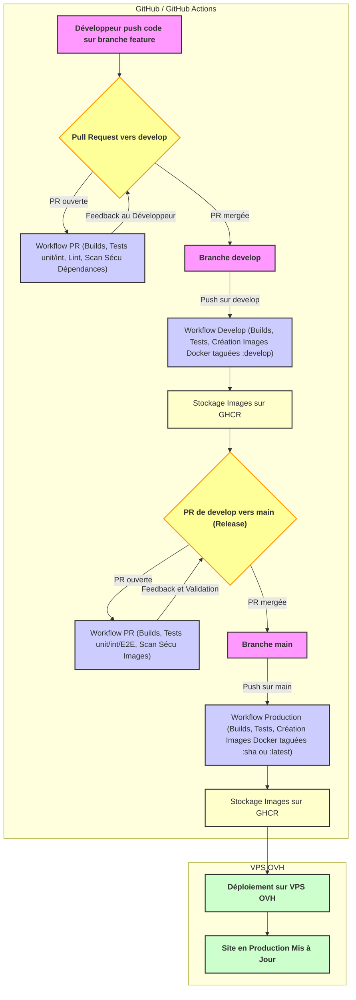

# Blog Technique Bilingue - Pipeline CI/CD avec GitHub Actions

## 1. Introduction et Objectifs

Ce document décrit l'architecture, la configuration et le fonctionnement du pipeline d'Intégration Continue et de Déploiement Continu (CI/CD) pour le projet "Blog Technique Bilingue". Le pipeline est implémenté à l'aide de **GitHub Actions**.

**Objectifs Principaux du Pipeline CI/CD :**

* **Automatisation des Builds :** Compiler et packager automatiquement les applications frontend (Astro) et backend (Spring Boot) à chaque modification du code source.
* **Assurance Qualité Continue :** Exécuter automatiquement une suite de tests (unitaires, intégration, E2E, sécurité) pour détecter les régressions et les vulnérabilités au plus tôt dans le cycle de développement.
* **Déploiements Fiables et Reproductibles :** Automatiser le processus de déploiement des nouvelles versions des applications sur le serveur VPS de production, réduisant ainsi les erreurs manuelles et assurant la cohérence.
* **Livraison Rapide de Valeur :** Permettre des mises en production fréquentes et rapides des nouvelles fonctionnalités et des correctifs.
* **Visibilité et Traçabilité :** Fournir un retour d'information clair sur l'état des builds, des tests et des déploiements.

Ce document détaillera les différents workflows, les étapes clés, les outils utilisés et les configurations nécessaires.

## 2. Vue d'Ensemble de l'Architecture du Pipeline CI/CD

Notre pipeline CI/CD s'appuie sur **GitHub Actions** pour automatiser l'intégration, les tests, la création d'artéfacts et le déploiement du "Blog Technique Bilingue". Étant donné que nous avons une approche monorepo avec un frontend Astro et un backend Spring Boot distincts, nous aurons des workflows GitHub Actions séparés mais coordonnés.

### 2.1. Structure des Workflows

Nous prévoyons deux workflows principaux, situés dans `.github/workflows/` :

1.  **`ci-cd-frontend.yml` :** Dédié au build, aux tests et au déploiement du frontend Astro.
    * **Déclencheurs :**
        * `push` sur la branche `main`.
        * `push` sur la branche `develop`.
        * `pull_request` ciblant les branches `main` ou `develop` (pour les étapes de tests et de validation).
    * **Responsabilités principales :**
        * Installation des dépendances Node.js et PNPM.
        * Linting et formatage du code TypeScript/Astro.
        * Exécution des tests unitaires et d'intégration frontend (Vitest).
        * Exécution des tests E2E (Cypress) sur un environnement de prévisualisation (si configuré).
        * Build de l'application Astro statique.
        * Analyse de sécurité des dépendances (PNPM Audit).
        * Build de l'image Docker pour le frontend (incluant Nginx et les fichiers statiques).
        * Analyse de sécurité de l'image Docker (Trivy).
        * Push de l'image Docker vers GitHub Container Registry (GHCR).
        * Déploiement de l'image Docker frontend sur le VPS (sur `push` vers `main`).

2.  **`ci-cd-backend.yml` :** Dédié au build, aux tests et au déploiement du backend Spring Boot.
    * **Déclencheurs :**
        * `push` sur la branche `main`.
        * `push` sur la branche `develop`.
        * `pull_request` ciblant les branches `main` ou `develop`.
    * **Responsabilités principales :**
        * Installation du JDK et de Maven.
        * Compilation du code Java.
        * Exécution des tests unitaires et d'intégration backend (JUnit, Mockito, Spring Test).
        * Analyse de sécurité des dépendances (Maven Dependency-Check).
        * Packaging de l'application Spring Boot (fichier JAR).
        * Build de l'image Docker pour le backend.
        * Analyse de sécurité de l'image Docker (Trivy).
        * Push de l'image Docker vers GitHub Container Registry (GHCR).
        * Déploiement de l'image Docker backend sur le VPS (sur `push` vers `main`), incluant potentiellement l'exécution des migrations Liquibase.

**Chemins de déclenchement conditionnels :**
Chaque workflow sera configuré pour ne s'exécuter que si des modifications sont détectées dans les répertoires respectifs (`frontend/` ou `backend/`) afin d'optimiser l'utilisation des ressources GitHub Actions. Par exemple :
```yaml
# Extrait pour ci-cd-frontend.yml
# on:
#   push:
#     branches: [ main, develop ]
#     paths:
#       - 'frontend/**'
#       - '.github/workflows/ci-cd-frontend.yml'
#   pull_request:
#     branches: [ main, develop ]
#     paths:
#       - 'frontend/**'
#       - '.github/workflows/ci-cd-frontend.yml'
````

### 2.2. Artéfacts Clés Produits

- **Images Docker :**
    - `ghcr.io/VOTRE_ORGANISATION_OU_UTILISATEUR/blog-technique-frontend:TAG`
    - `ghcr.io/VOTRE_ORGANISATION_OU_UTILISATEUR/blog-technique-backend:TAG` Les `TAG` correspondront typiquement au hash du commit Git (`${{ github.sha }}`) pour une traçabilité unique, ou à des versions sémantiques si une stratégie de versioning est mise en place.
- **Rapports de Tests :** Les résultats des tests (unitaires, E2E, sécurité) seront disponibles sous forme d'artéfacts ou directement dans l'interface GitHub Actions.
- **Rapports de Couverture de Code :** (Optionnel, mais recommandé) Peuvent être générés et stockés comme artéfacts ou envoyés à des services comme Codecov.

### 2.3. Environnements et Déclencheurs de Déploiement

- **Développement (`develop` branch) :**
    - Les `push` vers `develop` peuvent déclencher un build, des tests, et la création d'images Docker taguées comme `develop` ou `latest-develop`.
    - Aucun déploiement automatique en production n'est effectué depuis `develop`. Un déploiement sur un environnement de staging (Post-MVP) pourrait être envisagé à partir de cette branche.
- **Production (`main` branch) :**
    - Les `push` (typiquement après un merge depuis `develop` suite à une `pull_request` validée) vers `main` déclenchent le pipeline complet, incluant le déploiement sur le VPS de production.
- **Pull Requests :**
    - Les `pull_request` ciblant `main` ou `develop` déclenchent les étapes de build, de linting et de tests pour s'assurer que le code est valide avant le merge. Cela inclut les tests unitaires, d'intégration, et potentiellement les analyses de sécurité. Les tests E2E peuvent être exécutés manuellement ou sur un déclencheur spécifique pour les PRs afin de ne pas ralentir excessivement le feedback.

### 2.4. Schéma Général du Flux CI/CD

Extrait de code



## 3. Prérequis et Configuration

Pour que les pipelines CI/CD fonctionnent correctement et puissent interagir avec les services externes (GHCR, VPS OVH), une configuration adéquate des secrets et des environnements est nécessaire.

### 3.1. Secrets GitHub Actions

Les informations sensibles utilisées par les workflows GitHub Actions doivent être stockées en tant que "Encrypted Secrets" dans les paramètres du dépôt GitHub (`Settings > Secrets and variables > Actions`).

**Secrets requis pour les workflows (`ci-cd-frontend.yml` et `ci-cd-backend.yml`) :**

- **`GHCR_USERNAME`**: Nom d'utilisateur pour GHCR (ex: `${{ github.actor }}`).
- **`GHCR_TOKEN`**: Personal Access Token (PAT) avec permissions `write:packages`.
- **`VPS_SSH_HOST`**: Adresse IP ou nom d'hôte du VPS OVH.
- **`VPS_SSH_USER`**: Nom d'utilisateur sur le VPS pour SSH (ex: `deployer`).
- **`VPS_SSH_PRIVATE_KEY`**: Clé privée SSH pour la connexion au VPS.
- **`VPS_SSH_PORT`**: Port SSH du VPS (défaut `22`).

(Référence : docs/setup/environnement-vars.md pour la liste des variables d'environnement applicatives)

Pour le MVP, le fichier .env de production est géré directement sur le VPS.

### 3.2. Configuration des Environnements GitHub Actions (Optionnel pour MVP)

Pour le MVP, nous utiliserons les secrets au niveau du dépôt. Les environnements GitHub Actions pourront être configurés post-MVP pour une gestion plus fine (ex: staging, production avec approbations).

### 3.3. Préparation du VPS pour le Déploiement Initial

Le VPS doit être configuré comme décrit dans `docs/operations/runbook.md` (Section 1) :

- Utilisateur de déploiement avec accès SSH par clé.
- Docker et Docker Compose installés.
- Répertoire de déploiement (ex: `/opt/blog-technique-bilingue`) créé.
- Fichier `.env` de production sécurisé et `docker-compose.prod.yml` présents sur le VPS.

### 3.4. Registre de Conteneurs (GHCR)

Les images Docker seront poussées sur GHCR. Le `GHCR_TOKEN` doit avoir les permissions nécessaires.

## 4. Workflow CI/CD Frontend (`ci-cd-frontend.yml`)

Ce workflow est responsable du cycle de vie CI/CD de l'application frontend Astro.

### 4.1. Déclencheurs (Triggers)

YAML

```
# .github/workflows/ci-cd-frontend.yml
name: CI/CD Frontend Astro

on:
  push:
    branches: [ main, develop ]
    paths:
      - 'frontend/**'
      - '.github/workflows/ci-cd-frontend.yml'
  pull_request:
    branches: [ main, develop ]
    paths:
      - 'frontend/**'
      - '.github/workflows/ci-cd-frontend.yml'
  workflow_dispatch:
```

### 4.2. Variables d'Environnement Globales au Workflow

YAML

```
env:
  PNPM_VERSION: 8
  NODE_VERSION: 22
  WORKING_DIRECTORY: ./frontend
  DOCKER_IMAGE_NAME_FRONTEND: blog-technique-frontend
  GHCR_REGISTRY: ghcr.io
  GHCR_IMAGE_OWNER: ${{ github.repository_owner }}
```

### 4.3. Jobs et Étapes

#### 4.3.1. Job : `lint-format-check`

- **Objectif :** Valider qualité et formatage du code.
- **Étapes :** Checkout, Setup PNPM, Setup Node.js (avec cache PNPM), Install Dependencies (`pnpm install --frozen-lockfile`), Run Linter (ESLint via `pnpm lint`), Run Formatter Check (Prettier via `pnpm format:check`).

#### 4.3.2. Job : `unit-integration-tests`

- **Objectif :** Exécuter tests unitaires/intégration frontend.
- **Étapes :** Checkout, Setup PNPM, Setup Node.js, Install Dependencies, Run Unit & Integration Tests (Vitest via `pnpm test:unit`). Optionnel : Upload Test Results/Coverage.

#### 4.3.3. Job : `build-and-security-scan`

- **Objectif :** Construire l'application Astro, l'image Docker, et scanner la sécurité.
- **Étapes :** Checkout, Setup PNPM, Setup Node.js, Install Dependencies, Build Astro App (`pnpm build`), Security Scan Dependencies (`pnpm audit --audit-level=critical`), Setup Docker Buildx, Login to GHCR (conditionnel), Build Docker Image (avec `docker/build-push-action`, tags multiples, push conditionnel), Security Scan Docker Image (Trivy avec `aquasecurity/trivy-action`, `exit-code: 1` pour CRITICAL/HIGH). Optionnel : Upload Trivy Scan Results.

#### 4.3.4. Job : `e2e-tests` (Optionnel sur PR)

- **Objectif :** Exécuter tests E2E avec Cypress.
- **Stratégie PRs :** Peut builder et servir localement dans le runner.
- **Étapes :** Checkout, Setup PNPM, Setup Node.js, Install Dependencies, Build Astro App, Start Local Server & Run Cypress Tests (`cypress-io/github-action` avec `build` et `start` scripts). Optionnel : Upload Cypress Artifacts.

#### 4.3.5. Job : `deploy-to-vps`

- **Objectif :** Déployer image Docker frontend sur VPS.
- **Exécution :** Uniquement sur `push` vers `main`, si jobs précédents OK.
- **Étapes :** Deploy to VPS via SSH (`appleboy/ssh-action` ou similaire) :
    - `cd /opt/blog-technique-bilingue`
    - `docker compose -f docker-compose.prod.yml pull frontend_service_name`
    - `docker compose -f docker-compose.prod.yml up -d --no-deps frontend_service_name`
    - `docker image prune -af`

## 5. Workflow CI/CD Backend (`ci-cd-backend.yml`)

Ce workflow gère le cycle de vie CI/CD de l'application backend Spring Boot.

### 5.1. Déclencheurs (Triggers)

YAML

```
# .github/workflows/ci-cd-backend.yml
name: CI/CD Backend Spring Boot

on:
  push:
    branches: [ main, develop ]
    paths:
      - 'backend/**'
      - '.github/workflows/ci-cd-backend.yml'
  pull_request:
    branches: [ main, develop ]
    paths:
      - 'backend/**'
      - '.github/workflows/ci-cd-backend.yml'
  workflow_dispatch:
```

### 5.2. Variables d'Environnement Globales au Workflow

YAML

```
env:
  JAVA_VERSION: '21'
  MAVEN_VERSION: '3.9.6' # Optionnel si mvnw est utilisé partout
  WORKING_DIRECTORY: ./backend
  DOCKER_IMAGE_NAME_BACKEND: blog-technique-backend
  GHCR_REGISTRY: ghcr.io
  GHCR_IMAGE_OWNER: ${{ github.repository_owner }}
```

### 5.3. Jobs et Étapes

#### 5.3.1. Job : `lint-build-test`

- **Objectif :** Valider, compiler, tester le code backend.
- **Étapes :** Checkout, Setup Java (JDK avec cache Maven), (Optionnel: Setup Maven), Run Linter/Static Analysis (Checkstyle/PMD via `./mvnw validate` ou phases dédiées), Compile & Run Tests (JUnit/Mockito/Spring Test via `./mvnw test`), Security Scan Dependencies (OWASP Dependency-Check via `./mvnw dependency-check:check -DfailBuildOnCVSS=7`). Optionnel : Upload Test Results/Coverage.

#### 5.3.2. Job : `build-docker-and-security-scan`

- **Objectif :** Packager l'application, créer l'image Docker, et scanner.
- **Dépendances :** `needs: lint-build-test`
- **Étapes :** Checkout, Setup Java, Package Application (Build JAR via `./mvnw package -DskipTests`), Setup Docker Buildx, Login to GHCR (conditionnel), Build Docker Image (avec `docker/build-push-action`, tags, push conditionnel), Security Scan Docker Image (Trivy). Optionnel : Upload Trivy Scan Results.

#### 5.3.3. Job : `deploy-to-vps`

- **Objectif :** Déployer image Docker backend sur VPS.
- **Exécution :** Uniquement sur `push` vers `main`, si jobs précédents OK.
- **Dépendances :** `needs: build-docker-and-security-scan`
- **Étapes :** Deploy to VPS via SSH :
    - `cd /opt/blog-technique-bilingue`
    - `docker compose -f docker-compose.prod.yml pull backend_service_name`
    - **Gestion Migrations Liquibase :** De préférence, configurer Liquibase pour s'exécuter au démarrage de l'application Spring Boot (contenu dans l'image). Le `up -d` suivant appliquera les migrations.
    - `docker compose -f docker-compose.prod.yml up -d --no-deps backend_service_name`
    - `docker image prune -af`

## 6. Considérations Générales et Bonnes Pratiques

- **Optimisation des Temps de Build :** Utiliser les caches (Maven, PNPM, Docker layers, GitHub Actions). Paralléliser les jobs.
- **Sécurité des Pipelines :** Gérer les secrets avec soin, réviser les actions tierces, éviter les scripts arbitraires.
- **Idempotence des Déploiements :** Les scripts de déploiement doivent être idempotents.
- **Maintenance des Workflows :** YAML clairs, commentés, versions d'actions figées.
- **Gestion des Dépendances des Outils CI :** Spécifier les versions des outils (Node, Java, etc.).
- **Tests des Workflows :** Tester sur branches de feature/PRs.

## 7. Gestion des Erreurs et Notifications dans le Pipeline

- **Échec de Job :** Un échec sur une étape critique bloque le workflow et le déploiement/merge.
- **Notifications :** GitHub Actions notifie par e-mail. Post-MVP, envisager Slack/Teams.
- **Logs de Workflow :** Disponibles dans GitHub Actions pour diagnostic. `ACTIONS_STEP_DEBUG: true` pour plus de détails.

## 8. Change Log

|   |   |   |   |
|---|---|---|---|
|**Date**|**Version**|**Description**|**Auteur**|
|2025-05-11|0.1|Création initiale du document CI/CD. Sections incluses : Introduction, Vue d'Ensemble, Prérequis, Workflow Frontend, Workflow Backend.|3 - Architecte (IA) & Utilisateur|
|2025-05-11|0.2|Ajout des sections Considérations Générales, Gestion des Erreurs et Notifications, et Change Log.|3 - Architecte (IA) & Utilisateur|
