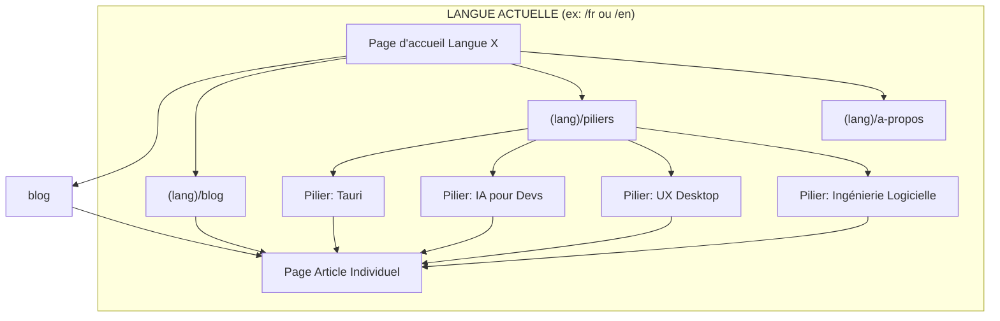
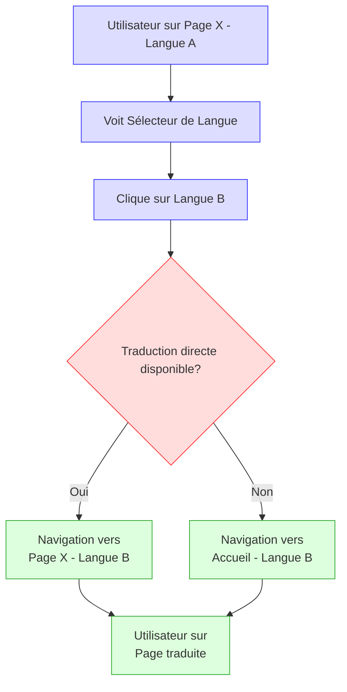
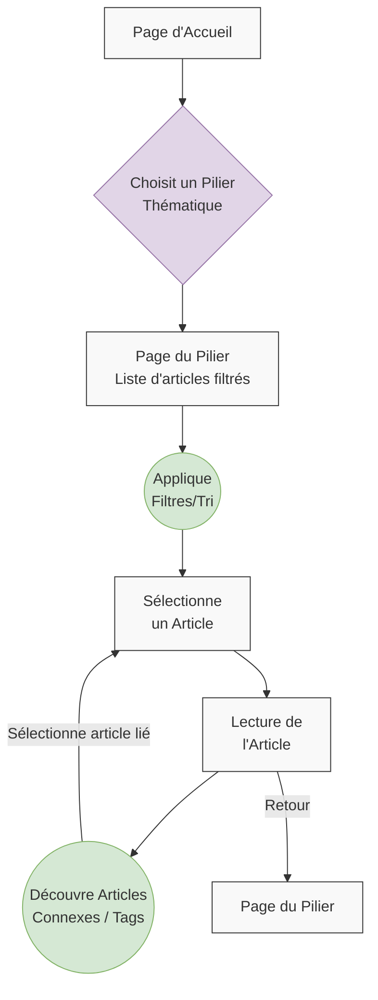

# Blog Technique Bilingue - Spécifications UI/UX

## 1. Introduction

Ce document détaille les spécifications de l'Interface Utilisateur (UI) et de l'Expérience Utilisateur (UX) pour le "Blog Technique Bilingue". L'objectif est de créer une plateforme non seulement riche en contenu technique de qualité, mais aussi agréable, intuitive et accessible pour tous les utilisateurs, qu'ils consultent le site en français ou en anglais. Une bonne UX est cruciale pour l'engagement des lecteurs, la crédibilité du blog et l'atteinte des objectifs du projet.

Ce document s'appuie sur les exigences définies dans le PRD (`prd-blog-bilingue.txt`) et tient compte de la stack technique choisie (Astro, TailwindCSS, DaisyUI), ainsi que des recommandations du rapport de recherche "Conception UI/UX Optimale pour un Blog Technique Bilingue avec Astro, TailwindCSS et DaisyUI" (ci-après désigné comme "Rapport UI/UX") et du document "Description des Éléments d'Interface du Thème" fourni par l'utilisateur.

## 2. Objectifs UX Clés

Nos efforts en matière d'UX viseront principalement à atteindre les objectifs suivants :

-   **Lisibilité Optimale :** Le contenu technique, y compris les extraits de code, doit être présenté de manière exceptionnellement claire, lisible et facile à comprendre sur tous les appareils.
-   **Navigation Intuitive :** Les utilisateurs doivent pouvoir trouver facilement les articles (via la navigation principale, les catégories/tags, la recherche) et naviguer sans effort entre les thématiques et les versions linguistiques.
-   **Engagement Facilité (MVP) :** Il doit être simple et non intrusif de partager les articles sur les réseaux sociaux et de fournir un feedback sur leur utilité ("Article utile ? Oui/Non").
-   **Expérience Bilingue Fluide :** Le passage entre les versions française et anglaise d'un article ou du site en général doit être évident, sans friction, et maintenir le contexte autant que possible.
-   **Performance et Réactivité :** L'interface doit se charger rapidement et être réactive aux interactions de l'utilisateur, contribuant à une expérience positive (en lien avec les NFRs de performance).
-   **Accessibilité (WCAG 2.1 AA de Base) :** Le site doit être utilisable par le plus grand nombre, y compris les personnes en situation de handicap, en respectant les standards d'accessibilité web.
-   **Esthétique Professionnelle et Épurée :** Le design doit être moderne, professionnel et sobre, mettant en valeur le contenu sans le surcharger visuellement.
-   **"Nativité Perçue" pour le Contenu UX Desktop :** Pour les articles traitant de l'UX des applications de bureau, le design du blog lui-même et ses exemples devront illustrer les principes d'une bonne expérience utilisateur "native". (Objectif spécifique du PRD)

## 3. Principes de Design Généraux

Les principes suivants guideront la conception de l'UI et de l'UX :

-   **Priorité au Contenu (Content-First) :** Le design doit servir le contenu et faciliter sa consommation. L'interface doit être discrète et ne pas distraire de la lecture. (Rapport UI/UX, Section 2.1)
-   **Simplicité et Clarté :** Privilégier des interfaces épurées, une hiérarchie visuelle claire, et des interactions simples à comprendre. Éviter la complexité inutile. (Rapport UI/UX, Section 2.1)
-   **Cohérence :** Maintenir une cohérence visuelle (couleurs, typographie, espacements, style des composants) et interactive à travers toutes les pages et les deux versions linguistiques du site. (Rapport UI/UX, Section 2.2)
-   **Feedback Utilisateur :** Fournir un retour visuel clair aux actions de l'utilisateur. (Rapport UI/UX, Section 2.4)
-   **Approche Mobile-First / Responsive Design :** Concevoir pour les appareils mobiles en premier lieu, puis adapter l'expérience pour les écrans plus grands. (Rapport UI/UX, Section 2.5)
-   **Performance comme Feature :** Optimiser tous les aspects de l'UI pour des temps de chargement rapides.
-   **Accessibilité Intégrée :** Penser à l'accessibilité dès les premières phases de conception et la vérifier tout au long du développement. (Rapport UI/UX, Section 7)

## 4. Identité Visuelle et Thème

L'identité visuelle doit être professionnelle, moderne et optimisée pour la lisibilité tout en reflétant les thématiques techniques du blog (IA, UX, Tauri). Elle s'appuiera sur un système dual (clair/sombre) cohérent. Nous utiliserons DaisyUI, en personnalisant ses thèmes pour correspondre aux spécifications ci-dessous, et TailwindCSS pour les ajustements fins.

_(Les spécifications suivantes sont basées sur le document "Description des Éléments d'Interface du Thème" fourni.)_

### 4.1. Palette de Couleurs (Basée sur HSL)

Le thème s'adapte aux préférences de l'utilisateur pour un mode clair ou sombre. Avec TailwindCSS v4 et DaisyUI v5, ces couleurs sont maintenant configurées directement dans le fichier CSS principal via une approche "CSS-first".

#### 4.1.1. Mode Clair (Thème "customLight")

-   **Arrière-plan principal (`--b1` ou équivalent DaisyUI) :** Blanc pur (HSL: 0 0% 100%)
-   **Texte standard (`--bc` ou équivalent) :** Noir profond légèrement adouci (HSL: 0 0% 3.9%)
-   **Arrière-plan éléments secondaires (ex: cartes avec bordures, navigation latérale) :**
    -   Cartes : Fond blanc pur (HSL: 0 0% 100%) (se distingue par bordure/ombre)
    -   Navigation Latérale : Blanc légèrement grisé (HSL: 0 0% 98%)
-   **Texte éléments secondaires/navigation latérale :** Gris-bleu foncé (HSL: 240 5.3% 26.1%)
-   **Éléments d'accent/boutons secondaires (`--a` ou `--s`, fond) :** Gris très clair (HSL: 0 0% 96.1%)
    -   Texte sur accent/bouton secondaire : Noir adouci (HSL: 0 0% 3.9%)
-   **Boutons Primaires (`--p`, fond) :** Noir adouci (HSL: 0 0% 9%)
    -   Texte sur bouton primaire (`--pc`) : Blanc cassé (HSL: 0 0% 98%)
-   **Actions Destructives (fond) :** Rouge vif (HSL: 0 84.2% 60.2%)
    -   Texte sur action destructive : Blanc cassé
-   **Bordures et Séparateurs (`--b2`, `--b3` ou spécifiques) :** Gris clair (HSL: 0 0% 89.8%)
-   **État Focus (anneau) :** Noir adouci (HSL: 0 0% 3.9%)
-   **Éléments Actifs Navigation Latérale (fond) :** Presque noir teinté de bleu (HSL: 240 5.9% 10%)

#### 4.1.2. Mode Sombre (Thème "customDark")

-   **Arrière-plan principal (`--b1`) :** Quasi-noir (HSL: 0 0% 3.9%)
-   **Texte standard (`--bc`) :** Blanc cassé (HSL: 0 0% 98%)
-   **Arrière-plan éléments secondaires (ex: cartes avec bordures, navigation latérale) :**
    -   Cartes : Fond quasi-noir (HSL: 0 0% 3.9%) (se distingue par bordure/ombre)
    -   Navigation Latérale : Gris-bleu très foncé (HSL: 240 5.9% 10%)
-   **Texte éléments secondaires/navigation latérale :** Gris-bleu très clair (HSL: 240 4.8% 95.9%)
-   **Éléments d'accent/boutons secondaires (`--a` ou `--s`, fond) :** Gris très foncé (HSL: 0 0% 14.9%)
    -   Texte sur accent/bouton secondaire : Blanc cassé
-   **Boutons Primaires (`--p`, fond) :** Blanc cassé (HSL: 0 0% 98%)
    -   Texte sur bouton primaire (`--pc`) : Noir adouci (HSL: 0 0% 3.9%)
-   **Actions Destructives (fond) :** Rouge sombre (HSL: 0 62.8% 30.6%)
    -   Texte sur action destructive : Blanc cassé
-   **Bordures et Séparateurs (`--b2`, `--b3` ou spécifiques) :** Gris très foncé (HSL: 0 0% 14.9%)
-   **État Focus (anneau) :** Gris très clair (HSL: 0 0% 83.1%)
-   **Éléments Actifs Navigation Latérale (fond) :** Bleu moyen vif (HSL: 224.3 76.3% 48%)

#### 4.1.3. Implémentation CSS-first avec DaisyUI v5

Avec TailwindCSS v4 et DaisyUI v5, la configuration des thèmes se fait directement dans le fichier CSS principal via la directive `@plugin "daisyui"`. Voici un exemple d'implémentation :

```css
@plugin "daisyui" {
  themes: [
    {
      customLight: {
        "primary": "hsl(0 0% 9%)",      // Noir adouci (boutons primaires)
        "primary-content": "hsl(0 0% 98%)", // Texte sur primaire (blanc cassé)
        "secondary": "hsl(0 0% 96.1%)", // Gris très clair (boutons secondaires)
        "secondary-content": "hsl(0 0% 3.9%)",// Texte sur secondaire (noir adouci)
        "accent": "hsl(0 0% 96.1%)",    // Également gris très clair pour accent
        "neutral": "hsl(0 0% 26.1%)",   // Gris-bleu foncé (texte nav latérale)
        "base-100": "hsl(0 0% 100%)",  // Arrière-plan principal (blanc pur)
        "base-content": "hsl(0 0% 3.9%)", // Texte standard (noir profond adouci)
        // ... autres variables DaisyUI (info, success, warning, error) en HSL
        "--rounded-btn": "6px",        // Bordure des boutons
        "color-scheme": "light",      // Indique le schéma de couleur au navigateur
      },
    },
    {
      customDark: {
        "primary": "hsl(0 0% 98%)",    // Blanc cassé (boutons primaires)
        "primary-content": "hsl(0 0% 3.9%)", // Texte sur primaire (noir adouci)
        "secondary": "hsl(0 0% 14.9%)",// Gris très foncé (boutons secondaires)
        "secondary-content": "hsl(0 0% 98%)",// Texte sur secondaire (blanc cassé)
        "accent": "hsl(0 0% 14.9%)",
        "neutral": "hsl(240 4.8% 95.9%)",// Gris-bleu très clair (texte nav latérale)
        "base-100": "hsl(0 0% 3.9%)",  // Arrière-plan principal (quasi-noir)
        "base-content": "hsl(0 0% 98%)", // Texte standard (blanc cassé)
        // ... autres variables DaisyUI en HSL
        "--rounded-btn": "6px",
        "color-scheme": "dark",       // Indique le schéma de couleur au navigateur
      },
    },
  ],
  darkTheme: "customDark", // Thème utilisé avec prefers-color-scheme: dark
}
```

#### 4.1.4. Couleurs pour Visualisations de Données

Des palettes distinctes sont définies pour assurer la clarté des graphiques et visualisations.

-   **Mode Clair :**
    -   Données primaires : Orange-rouge (HSL: 12 76% 61%)
    -   Données secondaires : Turquoise (HSL: 173 58% 39%)
    -   Données tertiaires : Bleu-gris foncé (HSL: 197 37% 24%)
    -   Données quaternaires : Jaune (HSL: 43 74% 66%)
    -   Données quintes : Orange (HSL: 27 87% 67%)
-   **Mode Sombre :**
    -   Données primaires : Bleu vif (HSL: 220 70% 50%)
    -   Données secondaires : Vert turquoise (HSL: 160 60% 45%)
    -   Données tertiaires : Orange doré (HSL: 30 80% 55%)
    -   Données quaternaires : Violet (HSL: 280 65% 60%)
    -   Données quintes : Rose-rouge (HSL: 340 75% 55%)

### 4.2. Typographie

La typographie est conçue pour une lisibilité maximale du contenu technique. Avec TailwindCSS v4, la configuration des polices se fait directement dans le fichier CSS principal via la directive `@theme`.

-   **Polices de Caractères :**
    -   **Corps du Texte (et titres généraux) :**
        -   Police **Inter** (Sans-Serif).
        -   Cette police offre une excellente lisibilité et un bon support multilingue. Elle est importée via `@font-face` avec les fichiers situés dans `frontend/public/fonts/`.
    -   **Blocs de Code :**
        -   Police **JetBrains Mono** (Monospace).
        -   Appréciée pour sa clarté dans les environnements de développement. Configurée via `@theme` dans le fichier CSS principal.
-   **Configuration CSS-first des polices :**

    ```css
    @font-face {
        font-family: "Inter";
        src: url("/fonts/Inter-Regular.woff2") format("woff2");
        font-weight: normal;
        font-style: normal;
        font-display: swap;
    }
    @font-face {
        font-family: "Inter";
        src: url("/fonts/Inter-Bold.woff2") format("woff2");
        font-weight: bold;
        font-style: normal;
        font-display: swap;
    }
    /* ... autres variantes Inter et JetBrains Mono ... */

    @theme {
        --font-sans: "Inter", ui-sans-serif, system-ui, -apple-system, BlinkMacSystemFont,
            "Segoe UI", Roboto, "Helvetica Neue", Arial, "Noto Sans", sans-serif,
            "Apple Color Emoji", "Segoe UI Emoji", "Segoe UI Symbol", "Noto Color Emoji";
        --font-mono: "JetBrains Mono", ui-monospace, SFMono-Regular, Menlo,
            Monaco, Consolas, "Liberation Mono", "Courier New", monospace;
    }
    ```

-   **Taille des Polices :**
    -   Corps du texte : Base de `16px` (`1rem`), avec une échelle typographique proportionnelle (utilisant les utilitaires de taille de texte de TailwindCSS, ex: `text-base`, `text-lg`, `text-xl`, etc.).
    -   Hiérarchisation claire pour les titres H1-H6, avec des variations de taille et de graisse.
        -   Mode clair : Différents niveaux de noir pour la hiérarchisation.
        -   Mode sombre : Différents niveaux de blanc pour la hiérarchisation.
-   **Hauteur de Ligne (Interligne) :**
    -   Corps du texte : Environ `1.6` à `1.7` (ex: `leading-relaxed` ou `leading-loose` de TailwindCSS) pour un confort de lecture optimal.
-   **Longueur de Ligne :**
    -   Utilisation de la classe `max-w-prose` de TailwindCSS (qui limite à `65ch`) pour le conteneur principal des articles de blog pour une lisibilité optimale.
    -   Texte aligné à gauche (éviter le justifié).
-   **Plugin `@tailwindcss/typography` :**

    -   Intégré via la directive `@plugin "@tailwindcss/typography"` dans le CSS principal.
    -   Personnalisé via des surcharges CSS directes utilisant les variables DaisyUI :

    ```css
    @plugin "@tailwindcss/typography";

    /* Surcharges pour @tailwindcss/typography */
    .prose {
        color: var(
            --base-content
        ); /* Utilise la couleur de texte du thème actif */
    }

    .prose :where(a):not(:where([class~="not-prose"] *)) {
        color: var(
            --primary
        ); /* Utilise la couleur primaire du thème pour les liens */
    }

    /* ... autres surcharges pour les titres, le code, les blockquotes, etc. */
    ```

### 4.3. Sélecteur de Thème

Un sélecteur de thème est implémenté pour permettre aux utilisateurs de basculer entre le mode clair et le mode sombre selon leurs préférences :

-   **Composant :** `ThemeSwitcher.astro` dans `src/components/common/`.
-   **Fonctionnement :** Utilise la classe `theme-controller` de DaisyUI v5 pour basculer entre les thèmes définis.
-   **Persistance :** La préférence est stockée dans `localStorage` et est appliquée dès le chargement initial de la page via un script anti-FOUC (Flash Of Unstyled Content).
-   **Positionnement :** Dans le header global, à côté du sélecteur de langue.
-   **Design :** Utilise des icônes soleil/lune avec un toggle adaptatif aux modes clair/sombre.

### 4.4. Iconographie (MVP)

-   **Style :** Linéaire, minimaliste, moderne. Utilisation de SVG.
-   **Sources :** Heroicons, Feather Icons, ou Remix Icon. (Conforme Rapport UI/UX, Section 4.3)
-   **Utilisation :** Pour les boutons de partage, indicateurs de liens externes, sélecteur de langue (optionnel), bouton "copier code", etc.
-   **Accessibilité :** `aria-hidden="true"` pour les icônes décoratives ; `aria-label` ou texte alternatif pour les icônes interactives.

### 4.5. Animations et Transitions

-   **Subtilité et Fluidité :** Les animations et transitions seront utilisées avec parcimonie pour améliorer l'expérience sans distraire. (Source : Document Thème)
-   **Durée :** Transitions rapides mais visibles, typiquement `0.2s` (ex: `transition-all duration-200 ease-in-out`).
-   **Exemples :**
    -   Survol des boutons et contrôles interactifs.
    -   Ouverture/fermeture des accordéons (si utilisés).
    -   Apparition des menus déroulants/popovers.

### 4.6. Espacement et Layout Général

-   **Conteneur Principal :** Centré automatiquement, avec une largeur maximale (ex: `1400px` du document thème, mais `max-w-prose` sera utilisé pour le contenu textuel principal des articles).
-   **Rembourrage (Padding) :** Un rembourrage standard généreux (ex: `2rem` / `32px`, soit `p-8` de Tailwind) sera utilisé autour des blocs de contenu principaux pour aérer la page. (Source : Document Thème)
-   **Espace Blanc :** Utilisation généreuse de l'espace blanc pour améliorer la lisibilité et la séparation des éléments.

## 5. Architecture de l'Information et Navigation

Une architecture de l'information (AI) claire et une navigation intuitive sont essentielles pour permettre aux utilisateurs de trouver facilement le contenu qu'ils recherchent et de comprendre la structure du blog.

### 5.1. Plan du Site (Sitemap Conceptuel)

Le plan du site de base pour le MVP est le suivant :



_(Adapté de `ui-ux-spec-claude.md`, section "Site Map / Screen Inventory")_

**Pages Clés :**

-   **Page d'accueil (`/[lang]/`)**
-   **Page de listing du blog (`/[lang]/blog/`)**
-   **Pages des Piliers Thématiques (`/[lang]/pilier/{nom-pilier}/`)**
-   **Page d'Article Individuel (`/[lang]/blog/{slug-article}/`)**
-   **Page "À Propos" (`/[lang]/a-propos/`)**

### 5.2. Structure de Navigation Principale

Présente dans l'en-tête global (Header.astro).

(Source : ui-ux-spec-claude.md, section "Navigation Structure" et "Header Global")

-   **Éléments :** "Accueil", "Blog", "Piliers Thématiques" (menu déroulant), "À Propos".
-   **Indication Visuelle Page Active.**
-   **Sélecteur de Langue Global.**
-   **Barre de Recherche.**

### 5.3. Navigation Contextuelle et Fil d'Ariane

-   **Fil d'Ariane (Breadcrumbs) :** Présent sur pages de listing et articles.
-   **Navigation par Tags/Catégories :** Tags/catégories cliquables sur articles menant à des listings filtrés.

### 5.4. Flux Utilisateur Type

#### 5.4.1. Navigation entre Langues

_(Basé sur `ui-ux-spec-claude.md`, section "User Flows - Navigation entre langues")_

Extrait de code



#### 5.4.2. Découverte de Contenu par Thématique (Pilier)

_(Basé sur `ui-ux-spec-claude.md`, section "User Flows - Découverte de contenu par thématique")_

Extrait de code



## 6. Spécifications Détaillées des Pages et Composants Clés

Cette section détaille les spécifications pour les principaux types de pages et les composants d'interface utilisateur réutilisables.

### 6.1. Header Global (Composant `Header.astro`)

_(Basé sur `ui-ux-spec-claude.md`, section 1.1, Rapport UI/UX, Sections 2.2, 6.1, et précisions utilisateur du 11/05/2025)_

-   **Positionnement et Style :**
    -   **Sticky :** Fixé en haut lors du défilement.
    -   **Fond Initial :** Transparent.
    -   **Fond au Défilement :** Fond transparent avec effet de flou (backdrop blur).
-   **Éléments (Disposition Desktop de Gauche à Droite) :**
    -   **A. Logo / Titre du Blog (Gauche) :** Lien vers accueil. Style : texte avec dégradé entre couleurs primaire et secondaire du thème.
    -   **B. Navigation Principale (Centre) :** Liens ("Accueil", "Blog", "Piliers Thématiques" via dropdown, "À Propos"). Indication visuelle du lien actif par couleur de texte.
    -   **C. Section Droite (Actions Utilisateur) :**
        -   **Icône de Recherche :** Au clic, remplace la navigation et les autres actions (sauf logo) par un champ de saisie pleine largeur. Résultats rapides en dropdown.
        -   **Sélecteur de Langue :** Deux boutons avec drapeaux français/anglais. Langue active mise en évidence.
        -   **Sélecteur de Thème (Clair/Sombre) :** Interrupteur ou bouton icône.
-   **Responsive (Mobile) :**
    -   Logo visible. Icône "hamburger" à droite.
    -   Au clic sur hamburger : Menu fullscreen avec navigation, sélecteurs de langue/thème, potentiellement recherche. Bouton "fermer". Fond opaque.

### 6.2. Page d'Accueil (`src/pages/[lang]/index.astro`)

#### 6.2.1. Section "Héros" (Hero Section)

_(Basé sur `ui-ux-spec-claude.md`, section 1.2)_

-   **Hauteur :** `100vh`. Disposition centrée.
-   **Éléments :** Photo de profil (optionnel), Titre Principal (H1), Sous-titre/Description, Légende d'appel à l'action, Bouton de défilement vers bas (flèche animée).
-   **Arrière-plan :** Couleur unie ou dégradé simple.

#### 6.2.2. Section Piliers de Contenu

_(Basé sur `ui-ux-spec-claude.md`, section 1.3)_

-   **Titre de Section (H2).**
-   **Disposition :** Grille responsive (3-4 cartes sur desktop).
-   **Carte de Pilier :** Icône, Titre du Pilier (H3), Description courte, Lien. Couleur d'accent du pilier optionnelle. Effet au survol.

#### 6.2.3. Section Articles Récents

_(Basé sur `ui-ux-spec-claude.md`, section 1.4)_

-   **En-tête de Section :** Titre (H2) et lien "Voir tous les articles".
-   **Disposition :** Grille responsive (3 colonnes desktop). 3, 6 ou 9 articles. Pas de pagination ici.
-   **Cartes :** Utilisation du composant `ArticleCard.astro`.

### 6.3. Page de Listing du Blog (`src/pages/[lang]/blog/index.astro`, etc.)

_(Basé sur `ui-ux-spec-claude.md`, section 2)_

#### 6.3.1. Structure Générale de la Page de Listing

-   **En-tête :** Fil d'Ariane, Titre Principal (H1 dynamique), Description (optionnelle).
-   **Layout Desktop :** Colonne de Filtrage (gauche), Zone Principale - Grille d'Articles.

#### 6.3.2. Bloc de Filtrage et Options

_(Basé sur `ui-ux-spec-claude.md`, section 2.2, avec ajustements du 11/05/2025)_

-   **Positionnement :** Colonne latérale gauche (desktop).
-   **Style :** Fond légèrement contrasté, bordures subtiles.
-   **Composants :**
    -   **Filtres par Piliers/Catégories :** Badges DaisyUI. Style non sélectionné : élément de couleur du pilier. Style sélectionné : fond de couleur du pilier. Sélection unique MVP.
    -   **Filtres par Tags :** Petit champ de filtre texte pour la liste des tags. Liste des tags en petits badges DaisyUI. Sélection unique MVP.
    -   **Options de Tri :** Menu déroulant DaisyUI `select` (Date publication récent/ancien).
-   **Responsive :** Panneau latéral DaisyUI `drawer` via bouton "Filtrer / Trier".

#### 6.3.3. Grille d'Articles et Pagination

_(Basé sur `ui-ux-spec-claude.md`, section 2.3)_

-   **Grille :** Responsive (3 col desktop, 2 tablette, 1 mobile).
-   **Cartes :** Composant `ArticleCard.astro`.
-   **Pagination :** Si > 9-12 articles. DaisyUI `join` avec `btn` numérotés, Précédent/Suivant.

### 6.4. Page d'Article Individuel

_(Basé sur `ui-ux-spec-claude.md`, section 3, et Rapport UI/UX, Sections 3, 4)_

#### 6.4.1. Structure Générale de la Page d'Article (Desktop : 3 colonnes)

-   **Colonne Centrale (Contenu Principal) :** Largeur `max-w-prose`.
    -   En-tête : Fil d'Ariane, Titre (H1), Métadonnées (Tags, Date, Temps de lecture).
    -   Corps (MDX) : Typo Inter, interligne 1.6-1.8.
    -   Fin d'Article : Sélecteur de langue spécifique, Module Feedback "Article utile ? Oui/Non".
-   **Colonne Gauche (Partage Flottante) :** Sticky, verticale. Icônes Twitter/X, LinkedIn, Reddit, Copier lien.
-   **Colonne Droite (Table des Matières Flottante - ToC) :** Sticky. Titre, liste H2/H3, highlight section active. Visible si >= 3 sections.

#### 6.4.2. Section "Articles Connexes"

_(Basé sur `ui-ux-spec-claude.md`, section 3.7)_

-   Position : Sous contenu principal. Titre (H2). 3-4 cartes `ArticleCard.astro` (même catégorie/tags).

#### 6.4.3. Responsive Design pour la Page d'Article

-   **Tablette :** 2 colonnes (Contenu, ToC). Partage compacté.
-   **Mobile :** 1 colonne. ToC en dropdown. Partage horizontal en bas ou via bouton.

### 6.5. Cartes d'Articles (Composant Réutilisable `ArticleCard.astro`)

_(Basé sur `ui-ux-spec-claude.md`, section 4, et ajustements du 11/05/2025)_

-   **Base :** DaisyUI `card` (ex: `card-compact` ou `card-bordered`).
-   **Structure :** Image d'en-tête (requise, ratio 16:9, lazy loading) -> Titre de l'article (H3/H4, lien, 2-3 lignes max) -> Métadonnées Haut (Tag principal/Pilier en badge couleur, Temps de lecture, Date) -> Extrait (2-3 lignes).
-   **Comportement :** Carte cliquable. Effet hover (élévation/bordure, titre change de couleur).
-   **Accessibilité :** Contrastes, focus visible, `alt` image.

### 6.6. Blocs de Code (Affichage dans les Articles)

_(Basé sur Rapport UI/UX, Sections 3.1.3, 4.1, 5.2, `ui-ux-spec-claude.md`, section 3.3, et précisions utilisateur du 11/05/2025)_

-   **Rendu :** Astro & Shiki (thèmes `github-light`/`github-dark` ou personnalisés).
-   **Typo :** JetBrains Mono ou Source Code Pro.
-   **Style Conteneur :** DaisyUI `mockup-code` ou `div` stylisé (fond distinct, padding, coins arrondis).
-   **Overflow :** Défilement horizontal (`overflow-x: auto`), pas de retour à la ligne forcé.
-   **Bouton "Copier le code" :** En haut à droite. Icône. "Sticky" interne lors du défilement vertical du bloc. `aria-label`, feedback visuel.
-   **Indication du Langage :** Claire.
-   **Numérotation des Lignes :** Affichée par défaut. Ne doit pas être copiée.
-   **Accessibilité :** Contraste des tokens.

### 6.7. Images et Diagrammes (Affichage dans les Articles)

_(Basé sur Rapport UI/UX, Section 4.2, et `ui-ux-spec-claude.md`, section 3.3)_

-   **Formats/Optimisation :** JPEG, PNG, SVG, WebP/AVIF. Redimensionnement, compression, lazy loading (`loading="lazy"`).
-   **Intégration :** Proximité texte, introduction, alignement centré par défaut, espacement.
-   **Légendes (`<figcaption>`) :** Sous l'image/diagramme, descriptives. Utiliser `<figure>`.
-   **Accessibilité :** `alt` obligatoire et descriptif. Descriptions longues pour diagrammes complexes (texte adjacent, `<figcaption>` détaillée, ou `aria-describedby`).
-   **Images Réactives :** `@astrojs/image` ou `srcset`/`sizes`.
-   **Option Zoom/Agrandissement :** Pour diagrammes/captures détaillées (modale DaisyUI).

### 6.8. Éléments d'Interaction Utilisateur (MVP)

#### 6.8.1. Boutons de Partage Social

-   **Objectif :** Partage facile, comptage anonyme.
-   **Position :** Barre latérale gauche flottante (desktop), bas d'article ou modale (mobile).
-   **Réseaux :** Twitter/X, LinkedIn, Reddit, Copier lien.
-   **Design :** Icônes SVG, `btn btn-ghost btn-square`, tooltip au survol.
-   **Comportement :** Ouvre partage, appel API asynchrone au backend. Échec appel API n'empêche pas partage.
-   **Accessibilité :** `aria-label` descriptif.

#### 6.8.2. Module de Feedback "Article utile ?"

-   **Objectif :** Feedback simple et anonyme, comptage backend.
-   **Position :** Fin du contenu de l'article.
-   **Design :** Question localisée. Boutons "Oui"/"Non" (DaisyUI `btn`).
-   **Comportement :** Appel API asynchrone. Remplacement par message de remerciement ("Merci !"). État "voté" stocké localement (session/localStorage) pour éviter soumissions multiples.
-   **Accessibilité :** Boutons accessibles, message de remerciement accessible.

### 6.9. Éléments de Formulaire (Principes Généraux pour Futurs Usages)

_(Basé sur Document Thème, Section 4, et Rapport UI/UX, Sections 7.2.11, 7.2.13)_

-   **Composants DaisyUI :** `input`, `textarea`, `select`, `checkbox`, `radio`, `button`, `label`, `form-control`.
-   **Style Champs :** Mode clair/sombre avec bordures contrastées, coins arrondis (6px).
-   **Étiquettes (`<label>`) :** Toujours présentes et associées (`for`/`id`).
-   **Placeholders :** Indicatifs, ne remplacent pas les étiquettes.
-   **Validation/Erreurs :** Côté client (rapide) et serveur (impératif). Messages clairs, proches du champ, accessibles (couleur + texte, ARIA).
-   **États Champs :** Focus visible clair (anneau de focus conforme au thème), désactivé, lecture seule.
-   **Accessibilité :** Navigation clavier, étiquettes, erreurs accessibles.

## 7. Accessibilité (WCAG 2.1 Niveau AA)

L'objectif est de se conformer autant que possible aux WCAG 2.1 Niveau AA.

_(Basé sur Rapport UI/UX, Section 7, et `ui-ux-spec-claude.md`, section "Accessibility Considerations")_

### 7.1. Principes Fondamentaux (POUR)

-   **Perceptible, Opérable, Utilisable, Robuste.**

### 7.2. Checklist des Contrôles d'Accessibilité Clés

-   **Contraste des Couleurs (SC 1.4.3, 1.4.11) :** Audit et ajustement des thèmes DaisyUI.
-   **Texte Redimensionnable (SC 1.4.4) :** Unités relatives, test zoom.
-   **Images de Texte (SC 1.4.5) :** Éviter si HTML/CSS possible.
-   **Navigation au Clavier (SC 2.1.1, 2.1.2) :** Tout opérable, pas de piège.
-   **Ordre du Focus Logique (SC 2.4.3) :** Suivre ordre visuel.
-   **Focus Visible (SC 2.4.7) :** Indicateur clair. Personnaliser styles DaisyUI/Tailwind.
-   **Liens (Objectif et Contexte - SC 2.4.4) :** Textes descriptifs, `aria-label` pour icônes.
-   **Titres et Étiquettes (SC 2.4.6, 1.3.1) :** `<title>` unique, structure Hn sémantique, `<label for>` correcte.
-   **Langue de la Page (SC 3.1.1) et des Parties (SC 3.1.2) :** `lang` sur `<html>`, `<span>` pour changements de langue, `lang` sur options sélecteur de langue.
-   **Navigation et Identification Cohérentes (SC 3.2.3, 3.2.4) :** Layouts et composants réutilisables.
-   **Gestion des Erreurs de Saisie (SC 3.3.1, 3.3.3) :** Identification et description textuelle des erreurs.
-   **Nom, Rôle, Valeur (SC 4.1.2) :** HTML sémantique, ARIA correct pour composants dynamiques.
-   **Liens d'Évitement (SC 2.4.1) :** "Skip to content" visible au focus.
-   **Gestion du Focus pour Composants Interactifs** (Modales, Dropdowns).

### 7.3. Outils et Workflow de Test d'Accessibilité

-   **Automatisés :** Axe DevTools, Lighthouse, WAVE. Linters (eslint-plugin-astro-a11y).
-   **Manuels :** Navigation clavier, lecteurs d'écran (NVDA, VoiceOver), zoom, vérificateurs de contraste.
-   **Workflow :** Intégration continue des tests, revues manuelles.

## 8. Responsive Design et Points d'Arrêt (Breakpoints)

Approche "mobile-first".

_(Basé sur `ui-ux-spec-claude.md`, section "Responsive Design Considerations", et Rapport UI/UX, Section 2.5)_

### 8.1. Points d'Arrêt Standards de TailwindCSS

-   `sm` (640px), `md` (768px), `lg` (1024px), `xl` (1280px), `2xl` (1536px).

### 8.2. Adaptations Spécifiques des Composants et Layouts

-   **Header Global :** Menu hamburger fullscreen sur mobile.
-   **Section Hero :** Layout vertical sur mobile.
-   **Grilles d'Articles/Piliers :** 3 col (lg/xl), 2 col (md), 1 col (<md).
-   **Bloc de Filtrage Blog :** Drawer sur mobile/tablette.
-   **Page Article :** 3 col (lg+), 2 col (md), 1 col (<md avec ToC en dropdown, partage en bas).
-   **Typographie et Images :** Responsives.

### 8.3. Test du Responsive Design

-   Outils dev navigateurs, appareils physiques réels. Attention aux zones tactiles.

## 9. Change Log

|            |             |                                                                                                                                                                                                                                                                                                    |                                   |
| ---------- | ----------- | -------------------------------------------------------------------------------------------------------------------------------------------------------------------------------------------------------------------------------------------------------------------------------------------------- | --------------------------------- |
| **Date**   | **Version** | **Description**                                                                                                                                                                                                                                                                                    | **Auteur**                        |
| 2025-05-11 | 0.1         | Création initiale du document UI/UX. Sections : Introduction, Objectifs UX, Principes de Design, Identité Visuelle (basée sur document thème), Architecture de l'Information et Navigation.                                                                                                        | 3 - Architecte (IA) & Utilisateur |
| 2025-05-11 | 0.2         | Ajout des sections Spécifications Détaillées des Pages et Composants (Header, Page Accueil, Page Listing, Page Article, Carte Article, Blocs de Code, Images/Diagrammes, Interactions, Formulaires), Accessibilité, Responsive. Intégration des éléments de `ui-ux-spec-claude.md` et ajustements. | 3 - Architecte (IA) & Utilisateur |
